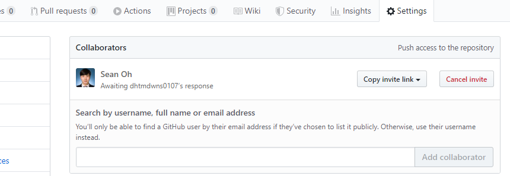
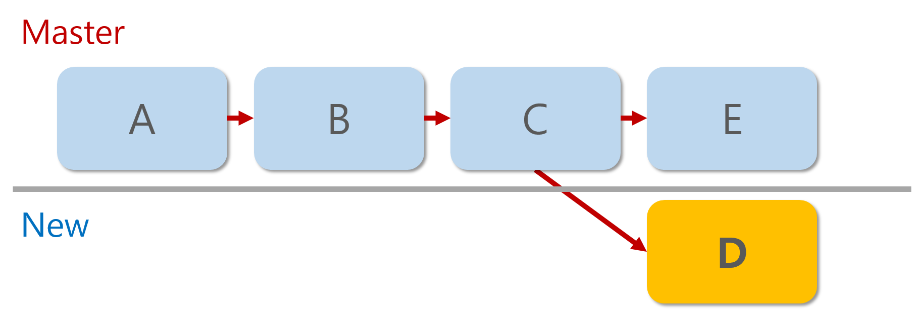
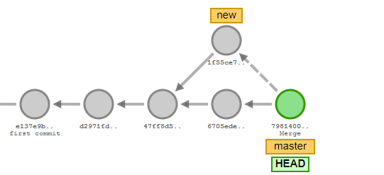
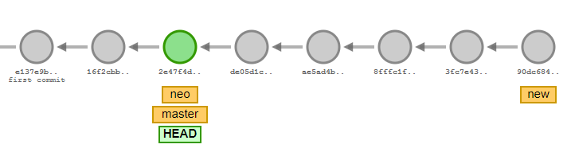
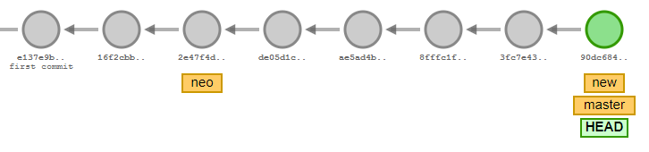

# 팀업하여 Github 활용하기

## (1)팀원과 Push and Pull

1. 팀장이 레포지토리 생성

2. 파일 생성 후 레포지토리에 업로드

3. 팀원이 원격 레포지토리에 업로드

4. 팀장의 레포지토리에 접근

   ```shell
   $ git clone http://github.com/naxvinci/[레포지토리네임]
   ```

   

5. 파일 오픈, 수정
6. 수정한게 보고싶으면 `git diff`
7. 업로드 git status로 확인

8. git add 하고 커밋 (되도록 한글은 피하기)

9. 그대로 push(이미 클론으로 인해 remote 지정되어있어서 )

- ​	단 `git push origin master` 이전에 `push` 권한을 줘야한다. 
  - collaborators 설정하기



10. 끝났으면 `git push origin master` ㄱㄱ

11. 팀장은 pull


## (2)Branch (브랜치)

>  기존에는 single branch인 master에서만 활동했지만 이제는 다양한 가상세상을 만들어 분리하여 요리조리 이동 가능하다


긴 코드를 작성하여 한 커밋에 업로드 하기 부담스러울 경우

논리적으로 쪼갤 수 있다 staging area

1. 브랜치 만들기 - `git branch [새로운 세상의 이름]`

- 분리된 branch를 확인하고 싶다면 `git branch`

2. 브랜치 간 이동하기 - `git switch [이동할 세상]` 

```shell
student@M15033 MINGW64 ~/branch (master)
$ git branch
* master
  new

student@M15033 MINGW64 ~/branch (master)
$ git switch new
Switched to branch 'new'

student@M15033 MINGW64 ~/branch (new)
$ git branch
  master
* new

```

3. 브랜치를 이동하고 log를 찍어보면 헤드 포인터도 이동한 것을 확인할 수 있다.

```shell
student@M15033 MINGW64 ~/branch (new)
$ git switch master
Switched to branch 'master'

student@M15033 MINGW64 ~/branch (master)
$ git log --oneline
4b81954 (HEAD -> master, new) Add c.txt
2b25c85 Add b.txt
b797e1d Add a.txt

```

4. 두 브랜치는 완전 다른 세상이기 때문에 한쪽 폴더나 파일은 반대쪽에서 보이지 않는다.



- Master Branch에서 보이는 파일 : a,b,c,e

- New Branch에서 보이는 파일 : a,b,c,d


## (3)Merge 두 브랜치 합치기

1. 병합 할 곳( master)으로 먼저 이동한다

2. `merge`명령으로 합병할 브랜치를 부른다  --> 이상한 창으로 이동하게 된다.

   `git merge [ 병합할 브랜치 이름]`

   ex) `$ git merge new`

3. esc 연타 후 	`:wq (write and quit)`

```shell
student@M15033 MINGW64 ~/branch (master)
$ git merge new
Merge made by the 'recursive' strategy.
 d.txt | 0
 1 file changed, 0 insertions(+), 0 deletions(-)
 create mode 100644 d.txt

student@M15033 MINGW64 ~/branch (master)
$ git log --oneline
21c338f (HEAD -> master) Merge branch 'new'
f8eccd7 Add e.txt
e41460b (new) Add d.txt
4b81954 Add c.txt
2b25c85 Add b.txt
b797e1d Add a.txt

```



4. merge 후 남은 branch는 지워주는게 좋다.

```shell
$ git branch -d new
```


### Merge 시나리오

#### 1. Fast Forward Merge

>  브랜치 분기가 일어났지만, merge 시점에서 branch 한쪽에서만 commit들이 쌓여있는 경우 (ex. new에만 commit이 있고, master에는 없을 때)


- 분기된 브랜치에서만 수정이 일어나고 master에서의 작업분이 없는 경우 발생
- 가장 쉬운 merge다





같은 줄 수정한 경우 merge 될 때 마지막 수정으로 덮어쓴다.

- Fast-forward merge를 하지 않을 경우

`git merge new --no-ff`


#### 2. Auto-merge

>  merge 시점에 양쪽 브랜치에 commit들이 쌓여있지만, Conflict가 발생하지 않는 경우


#### 3. Merge Conflict 발생

> merge 시점에 양쪽 브랜치에 commit들이 쌓여있고, conflict가 발생하는 경우

-  동일 파일 내에 상충하는 내용이 있을 경우

