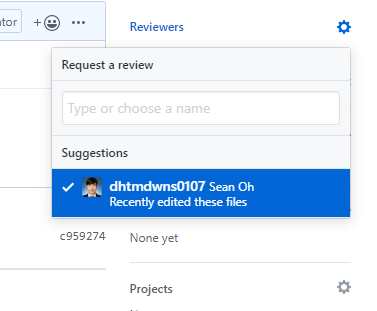

# Github flow (fork-PR)

branch를 활용하는 것이 Git flow였다면 fork-PR (Githubflow)

`code .` : 현재 폴더 기준으로 코드에디터 오픈

VSCODE에서 `!` + `tab`을 누르면 기본 HTML 템플릿이 자동완성

git add 파일 이름 여러개 쓰기도 가능

현재 폴더에 든 모든 파일 다 add 하라  = `.`

팀장은 Collaborators 탭에서 팀원에게 준 push 권한을 확인 가능하다.

Branches 탭에서는 Branch protection rules 를 통해 제한을 걸 수 있다.

나중에는 팀장이든 팀원이든 master 브랜치에 직접 push를 못하게 한다. github에 브랜치를 통으로 올리고 거기서 pull request를 통해 병합하는 방식을 채택한다.

branch를 나눈다 feature/home

깃헙에 branch 자체

`ul>li*2 `단축

깃헙 내에서 conflict 없이 pull request 

실제로는 팀장만 merge pull request만 가능하도록 설정을 하는 편이다.

리뷰어 요청

권한이 없는 레포지토리에도 오픈소스 기여를 하는 법

fork 활용하기

포크로 찍으면 그 레포지토리가 내 레포지토리로 복사된다

남의 원격저장소의 것을 내 원격저장소로 옮겨오는 것임

여기서는 push가 가능하다

