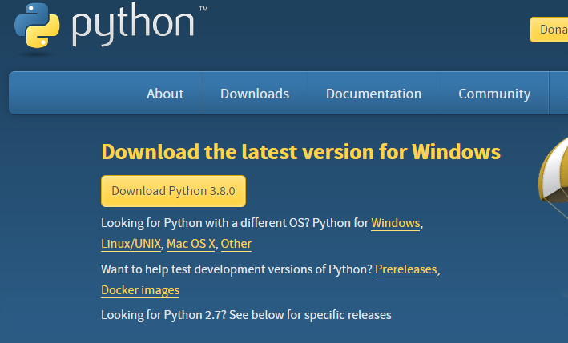

#### VSCODE에서 터미널 생성하기

1. VSCODE - Terminal - New Terminal
2. select default shell에서 `1:  bash`로 바꿔준다
3. VSCODE는 환경 변경에 즉각 대응이 안되므로 완전히 kill terminal 후 프로그램을 다시 실행해주어야 한다
4. `ctrl +shft+p`를 통해 명령어 직접 입력으로도 설정이 가능하다

---

# Python 기초

> *Life is short. You need Python. - Bruce Eckel*

1. 쉽다
2. 많은 사람들이 사용한다
3. 많은 것을 할 수 있다


언어 = 약속


#### * 프로그래밍 언어 : 3형식

1. 저장
2. 조건(if)
3. 반복(while)

#### * 파이썬에서 주의해야 할 3가지

1. 대소문자
2. 띄어쓰기
3. 스펠링

### Python 설치하기

1.  git bash 터미널에서 `python --version` 

   : 파이썬이 설치되어 있는지 확인

2. 파이썬 홈페이지에 들어가 Download

   - 이 때 3.8.0 버전의 64비트인지 확인할 것




## Python의 문법

### 1. 저장

> dust = 60 ; dust에 60을 저장한다
>
> dust == 60 ; dust와 60이 같다

#### 무엇을 저장하는가

1) 숫자

1. 현실 세계에 존재하는 모든 숫자(글자들어가면 안됨)
2. 기본적인 연산 가능 (계산기)

2) 글자

1. 현실 모든 글자 따옴표나 쌍따옴표로 감싸주기

3) 참/거짓

1. True, False 단 두가지. 앞글자 대문자
2. 조건/반복에 사용된다.

### 예제

`code python_basic.py `로 파일 생성

#### 1) 변수 선언

- 변수를 바로 선언 가능. `print`로 바로 출력 가능

```python
number = 123
number_two = -456
number_three = 7.89
print(number)
print(number_two)
print(number_three)
print(number, number_two, number_three)
```

- 출력 결과

```shell
$ python python_basic.py
123
-456
7.89
123 -456 7.89
```

> JAVA와는 달리 변수를 선언 할 때 string , int 등을 나눠 선언 할 필요가 없다 

#### 2) 불리언

- `print`의 다양한 방식


```python
a = '가나다'
b = '123'
c = 123
print(a, b, c, 123)
print(type(b), type(c), type(123))

d = True
e = False
print(d, e, type(d), type(e))
```

- 출력결과

```shell
가나다 123 123 123
<class 'str'> <class 'int'> <class 'int'>
True False <class 'bool'> <class 'bool'>
```

> 불리언을 선언 할 때도 `boolean`으로 선언할 필요 없다
>
> 주석처리는 #


#### 3) List 

- 자바에서의 array와 비슷한 개념

```python
array = [1,2,3,4,5,6,"넷", "다섯", "여섯", True]
print(array)
print(array[0:3])
print(array[4:])
print(array[-1])
```

>  리스트에서 슬라이싱할때에는 대괄호를 사용한다

- 리스트의 0번째부터 2번째까지 찍고 싶으면

```python
print(array[0:3])
```

- 음수의 경우 마지막 숫자에서부터를 의미한다

```python
print(array[-1])
```

- 출력결과

```shell
$ python array.py
[1, 2, 3, 4, 5, 6, '넷', '다섯', '여섯', True]
[1, 2, 3]
[5, 6, '넷', '다섯', '여섯', True]
True
```

#### 4) Dictionary

>  궁극의 박스 dictionary

- Dictionary의 활용

```python
dust = {'영등포구' : 50, "강남구" : 40}
print(dust['영등포구'])
dust_two = dict(영등포구 = 50)
print(dust_two)
```

- 출력 결과

```shell
$ python array.py
50
{'영등포구': 50}
```

> 중괄호로 만들땐 키값은 반드시 string이어야 하고, 따옴표도 있어야 한다.

> 함수 호출 형식으로 Dictionary를 만들 때는 따옴표 없이 한다.


#### 5) random


```python
import random

coffee = ['아이스아메리카노', '뜨거운아메리카노', '카페라떼', '커피믹스', '핫초코']

co = random.choice(coffee)
print(co)
```

랜덤으로 리스트 내의 항목을 뽑아 내는 함수


```python
numbers = list(range(1,10))
print(numbers)
```


출력

```shell
[1, 2, 3, 4, 5, 6, 7, 8, 9]
```

이때 numbers라는 리스트의 type을 알고 싶다면

```python
print(type(numbers))
```

출력결과

```shell
<class 'list'>
```


점심메뉴에 따라 점심메뉴와 전화번호를 함께 표출하는 예제

```python
import random

# menu 리스트를 만들어주세요.
menu = ['20층', '양자강', '김밥카페', '순남시레기', '바나프레소']
phone_book = { '20층' : '010-1234-1234', '양자강' : '010-4433-3322', '김밥카페' : '010-1234-1334', '순남시레기' : '010-1234-1444', '바나프레소' : '010-1234-1554'}  

choice = random.choice(menu)
print(choice, phone_book[choice])
```

출력결과 (랜덤임)

```shell
양자강 010-4433-3322
```


### 2. 조건

if (True)

​	

```
a = 0
if a:
    print("0입니다")
else:
    print("아닙니다")
```

출력 결과 아닙니다

```python
a = 30
if a > 30 :
    print("30 이상입니다")
elif a <= 20 :
    print("20 이하입니다")
else:
    print("둘다아닙니다")
```

출력결과 둘다아닙니다


파이썬은 띄어쓰기 기준으로 인식하기 때문에 spaces: 4 기준으로 바꿔준다

스페이스바 네개 혹은 탭 한번

and 는 두 조건 모두 true일 때만 리턴

```python
n = 0
while n < 3 :
    n = n + 1
    print('출력')
```

출력 3번이 된다


```python
numbers = list(range(10))
print(numbers)
for number in numbers : 
    print(number)
```

출력 결과

```shell
$ python while_for.py
[0, 1, 2, 3, 4, 5, 6, 7, 8, 9]
0
1
2
3
4
5
6
7
8
9
```


