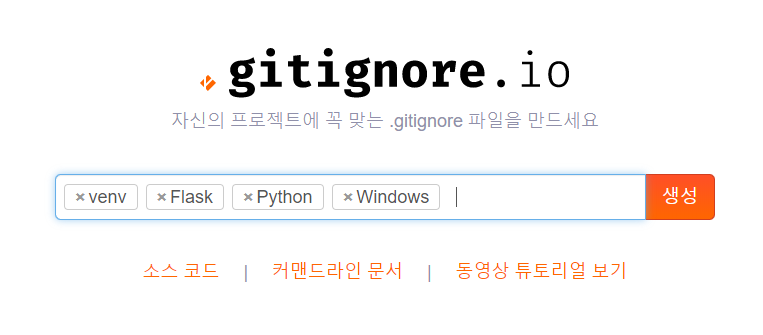
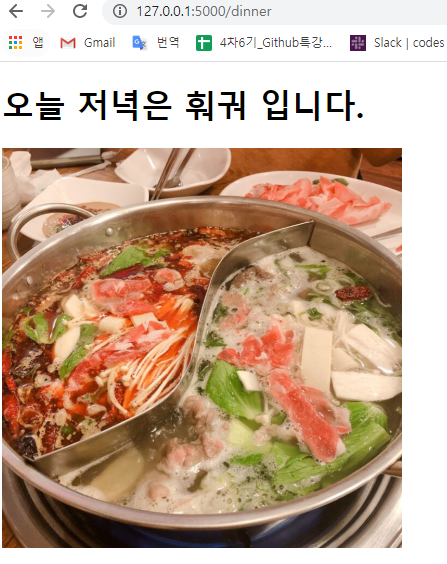

# 파이썬 기초 2

### 가상환경 세팅하기

### 1. 가상환경 세팅 확인 및 설치

`pip list`

가상환경 세팅  확인

뷰티풀 숲, 플라스크 등을 써볼 것이다!

venv는 파이썬에서 기본으로 제공하는 가상환경

그 다음 이름은 우리가 새로 만드는 가상환굥이름. 관례적으로 ㅍvenv

```
$python -m venv venv

$ source venv/Scripts/activate
```

가상환경 종료 시에는 `$ deactivate `

파일을 삭제할 경우 `rm -rf venv`

`pip freeze` - 모듈이름과 버전이름 리스트가 나온다. 모듈을 설치할 때 버전 네임을 쓰면 해당 버전을 정확하게 설치하게 도와주는 역할을 함

pip 패키지 관리자. 파이썬으로 작성된 패키지 소프트웨어를 설치 관리해주는 역할함

```
$ pip freeze > requirements.txt
$ pip install -r requirements.txt
```

requirements 내에서 깔린 버전들을 확인

> 코딩 도장 
>
> dojang.io

### 2. PIP 설치하기

뭘 깔고 싶다? --> `pip intall pandas`처럼 쓰면 된다넹

리퀘스트라는 pip를 설치하고 싶다

`$ pip install requests`

뷰티풀숲4 도 설치하고 싶다

`$ pip install beautifulsoup4`

### 3. PIP를 활용한 예제

#### 1) 코스피지수 가져오기

```python
import requests

url = "https://finance.naver.com/sise/"

# request = requests.get(url)
request = requests.get(url).text
print(request)
```

vscode에서 가상환경을 실행하면 vscode 바깥을 나갔다가 돌아온 경우 가상환경을 다시 켜줘야 한다.


copy selector

```python
import requests
from bs4 import BeautifulSoup

url = "https://finance.naver.com/sise/"

request = requests.get(url).text
soup = BeautifulSoup(request, 'html.parser')
kospi = soup.select_one("#KOSPI_now")
print(kospi.txt)
```

출력결과

```shell
student@M15033 MINGW64 ~/python (master)
$ python kospi.py
2,197.44
(venv) 
```

#### 2) 미국 환율 정보 가져오기

```python
import requests
from bs4 import BeautifulSoup

url = "https://finance.naver.com/marketindex/"

req = requests.get(url).text
soup = BeautifulSoup(req, 'html.parser') #json이나 xml 등도 파싱이 가능하다
exchange = soup.select_one('#exchangeList > li.on > a.head.usd > div > span.value')

print(exchange.text)
```

출력결과

```shell
student@M15033 MINGW64 ~/python (master)
$ python exchange.py
1,164.50
(venv) 
```


#### 3) 네이버 인기검색어 뽑아오기

```python
import requests
from bs4 import BeautifulSoup

url = "https://www.naver.com/"

request = requests.get(url).text
soup = BeautifulSoup(request, 'html.parser')
sel = "#PM_ID_ct > div.header > div.section_navbar > div.area_hotkeyword.PM_CL_realtimeKeyword_base > div.ah_roll.PM_CL_realtimeKeyword_rolling_base > div > ul > li > a > span.ah_k"
search = soup.select(sel)

for item in search :
    print(item.text)
```


출력결과

```shell
$ python naver.py
가결
트럼프 탄핵
최윤희
선미
가결 뜻
트럼프
무한도전
포방터시장
인방갤
몰카 bj
가세연
이세돌
엘클라시코
유재석
골목식당
이세돌 은퇴대국
bj
블랙머니
서울교통공사 채용
백두산
(venv) 
```

### 3. gitignore 활용하기

외부에 공개되면 안되는 파일을 생성하기

깃헙에 올릴 때 무시되도록

> http://gitignore.io/



코드 다 복사해서 깃으로 관리되는 가장 상위 폴더 안에 .gitignore파일로 만들어 넣기


모가 ignore 되는건데 글애서...?


### 4. Flask 활용하기

#### 1) flask 설치 및 환경 설정

- `venv` 다시 실행하고 `pip install flask`

- hello.py를 만들어서 아래 내용ㄱㄱ

```python
from flask import Flask, escape, request

app = Flask(__name__)

@app.route('/')
def hello():
    name = request.args.get("name", "World")
    return f'Hello, {escape(name)}!'
```

- bash 창에 아래 첫 줄을 입력하여 실행

```shell
$ env FLASK_APP=hello.py flask run
 * Serving Flask app "hello"
 * Running on http://127.0.0.1:5000/ (Press CTRL+C to quit)
```

- http://127.0.0.1:5000/ 주소를 크롬 창에 입력

- 여기에 추가로 아래 내용을 추가해서 저장

```python
from flask import Flask, escape, request

app = Flask(__name__)

@app.route('/')
def hello():
    name = request.args.get("name", "World")
    return f'Hello, {escape(name)}!'
    
if __name__== "__main__": 
    app.run(debug=True)

```

- 그럼 이제 `python hello.py`로 실행이 가능해지게 된다

```shell
student@M15033 MINGW64 ~/python/flask (master)
$ python hello.py
 * Serving Flask app "hello" (lazy loading)
 * Environment: production
   WARNING: This is a development server. Do not use it in a production deployment.
   Use a production WSGI server instead.
 * Debug mode: on
 * Restarting with stat
 * Debugger is active!
 * Debugger PIN: 131-642-734
 * Running on http://127.0.0.1:5000/ (Press CTRL+C to quit)
127.0.0.1 - - [19/Dec/2019 13:30:38] "GET / HTTP/1.1" 200 -
```


### 5) Flask 활용 예제

#### 5) - 1.  앱라우트로 웹에 출력하기

- `@app.route('/hi') ` : 슬래시 뒤 쪽에 원하는 링크명??? 을 쓴다.

- 함수 `def 함수이름()`를 작성

```python
from flask import Flask, escape, request, render_template

app = Flask(__name__)

@app.route('/')
def hello():
    name = request.args.get("name", "World")
    return f'Hello, {escape(name)}!'

@app.route('/hi')
def hi():
    name = "박나은"
    return render_template('hi.html', html_name = name)

if __name__== ("__main__"):
    app.run(debug=True)
```

> `render_template()`내에서 
>
> **좌측은 html에 넘겨줄 변수명**, 
>
> **우측은 파이썬 내에서 지정한 변수명**을 적어준다.

- templates 폴더 내에 hi.html 파일을 생성 

```html
<!DOCTYPE html>
<html lang="en">
<head>
    <meta charset="UTF-8">
    <meta name="viewport" content="width=device-width, initial-scale=1.0">
    <meta http-equiv="X-UA-Compatible" content="ie=edge">
    <title>Document</title>
</head>
<body>
    <h1>{{html_name}}</h1>
    <ul>
        <li>양자강</li>
        <li>20층</li>
        <li>스타벅스</li>
        <li>바나프레소</li>
        <li>이디야</li>
    </ul>

</body>
</html>
```

> 파이썬에서 넘어온 변수라는 것을 알려주기 위해 중괄호 두개로 감싸주어야 한다


#### 5) - 2.  변수 두개를 넘겨주는 경우

- 변수를 넘겨주는 `render_template` 내에서 쉼표로 구분하여 추가해 넣으면 된다.

```python
from flask import Flask, escape, request, render_template

app = Flask(__name__)

@app.route('/cube/<int:num>')
def cube(num):
    def_num = num**3
    return render_template('num3.html', html_name = def_num, num = num)

if __name__== ("__main__"):
    app.run(debug=True)
```

> `<int:num>` 숫자일 때만 작동하도록 지정

- html 파일을 생성
- `num` 변수와 `html_name` 변수를 함께 넘겨준다.

```html
<h1>{{num}}의 3제곱은<br>{{html_name}}입니다</h1>
```


#### 5) - 3. f string 사용하기

```python
from flask import Flask, escape, request, render_template

@app.route('/fstring')
def fstring():
    fstring = "박나은"
    return f"제 이름은 {fstring} 입니다."

if __name__== ("__main__"):
    app.run(debug=True)
```

문자열의 형태를 파기하지 않고 한 줄로 사용할 수 있게 해준다

검정색 fstring은 내가 지정한 변수명임 ㅋ


#### 5) -4. 랜덤으로 출력하기

- random 함수를 활용해서 값을 뽑는다

```python
from flask import Flask, escape, request, render_template
import random

@app.route('/dinner')
def dinner():
    menu = ['삼각김밥', '컵라면', '스테이크', '마라탕', '훠궈']
    dinner = random.choice(menu)
    return render_template('dinner.html', dinner = dinner)

if __name__== ("__main__"):
    app.run(debug=True)
```

html 파일에서는  요런식으로 출력

```html
<h1>오늘 저녁은 {{dinner}} 입니다.</h1>
```


#### 5) -5.이미지까지 함께 출력하기

-  `img_url = menu_img[dinner]`을 통해 Dictionary의 어느 항목을 말하는지 지정

```python
@app.route('/dinner')
def dinner():
    menu = ['삼각김밥', '컵라면', '스테이크', '마라탕', '훠궈']
    dinner = random.choice(menu)
    menu_img = {'삼각김밥': '//item.ssgcdn.com/96/16/97/item/1000024971696_i1_1200.jpg', 
                '컵라면' : 'http://image.auction.co.kr/itemimage/11/21/cd/1121cdc7b6.jpg', 
                '스테이크' : 'http://recipe1.ezmember.co.kr/cache/recipe/2017/07/09/6741acc7f6bf0f7d04245851fb365c311.jpg', 
                '마라탕' : 'https://t1.daumcdn.net/thumb/R1280x0/?fname=http://t1.daumcdn.net/brunch/service/user/4BYf/image/_pc0k6Jz3BHHLVwylaQYEPZdQd0.jfif', 
                '훠궈' : 'https://mp-seoul-image-production-s3.mangoplate.com/1250135_1547430500643161.jpg?fit=around|738:738&crop=738:738;*,*&output-format=jpg&output-quality=80'}
    img_url = menu_img[dinner]

    return render_template('dinner.html', dinner = dinner, img_url = img_url)
```

>  html을 만들어서 이미지를 삽입

```html
    <h1>오늘 저녁은 {{dinner}} 입니다.</h1>
    
```

> `alt`는 사진이 뜨지 않을 때 그 사진이 무엇인지를 알려줄 기능이다. 시각장애인에게 도움이 될 수 있다.



#### 5) -6. 영화 DB 만들기

for문과 if문 함께 활용

```python
from flask import Flask, escape, request, render_template

@app.route('/movies')
def movies():
    movies = ['조커', '겨울왕국2', '터미네이터', '어벤져스']
    return render_template('movies.html', movies = movies)

if __name__== ("__main__"):
    app.run(debug=True)
```

html만들기

html에서 for문과 if문을 적용하는 방법 

```html
<body>
    <ul>
        
            
                <li>{{movie}} || 이 영화 진짜 재밌어</li>
            
                <li>{{movie}} || 올라프 귀여워</li>
            
                <li>{{movie}}</li>
            
        
    </ul>
</body>
```

출력화면

```markdown
- 조커 || 이 영화 진짜 재밌어
- 겨울왕국2 || 올라프 귀여워
- 터미네이터
- 어벤져스
```


rendertemplate을 쓰면 {를 쓰는 순간 부터 파이썬. %쓰는 순간부터 문법이라 인식. 이 때 중간에서 주석을 쓰고 싶으면 {# #}로 쓰면 된다.


#### 5) -7. Ping Pong 예제


```python
from flask import Flask, render_template, request
app = Flask(__name__)

@app.route('/ping')
def ping():
    return render_template('ping.html')

@app.route('/pong')
def pong():
    data = request.args.get('keyword')
    return render_template('pong.html', data = data)

@app.route('/naver')
def naver():
    return render_template('naver.html')


if __name__== ("__main__"):
    app.run(debug=True)
```

> ping. html 문서에서 키값을 리퀘스트해서 가져오기 `data = request.args.get('keyword')` 한 후, data 변수로 pong.html로 보내준다.


ping.html

```html
    <h1>Here is Ping!!</h1>
    <form action="/pong">
        <input type="text" name="keyword">
        <input type="submit">
```

> ping 에서 키워드를 입력하면 `form action`을 통해 `/pong`으로 이동한다

pong.html

```html
    <h1>여기는 Pong입니다!!!</h1>
    {{data}}
```

> pong에서 파이썬에서 데려온 `data`를 출력


#### 5) -8. OP.GG 예제

> op.gg에 전적 검색을 하고 키값을 크롤링해서 가져온다

```python
from flask import Flask, escape, request, render_template
from bs4 import BeautifulSoup
import requests

app = Flask(__name__)

@app.route('/search')
def search():
    return render_template('search.html')

@app.route('/opgg')
def opgg():
    userName = request.args.get('userName')
    url = f"http://www.op.gg/summoner/userName={userName}"
    req = requests.get(url).text
    data = BeautifulSoup(req, 'html.parser')
    tier = data.select_one('#SummonerLayoutContent > div.tabItem.Content.SummonerLayoutContent.summonerLayout-summary > div.SideContent > div.TierBox.Box > div > div.TierRankInfo > div.TierRank')
    win = data.select_one('#SummonerLayoutContent > div.tabItem.Content.SummonerLayoutContent.summonerLayout-summary > div.SideContent > div.TierBox.Box > div > div.TierRankInfo > div.TierInfo > span.WinLose > span.wins')
    return render_template('opgg.html', userName = userName, url = url, tier = tier.text, win = win.text)

if __name__== "__main__": 
    app.run(debug=True)

```

> fstring을 사용하여 리퀘스트 해서 가져온 값을 바로 입력 가능하게 만든다. 
>
> BeautifulSoup을 통해 html에서 가져온 값을 parsing
>
> `.select_one()` 함수로 op.gg 페이지의 값을 긁어온다.
>
> + text만 남길 수 있도록 `render_plate`내의 파이썬 값에 `.text`를 붙여준다.


