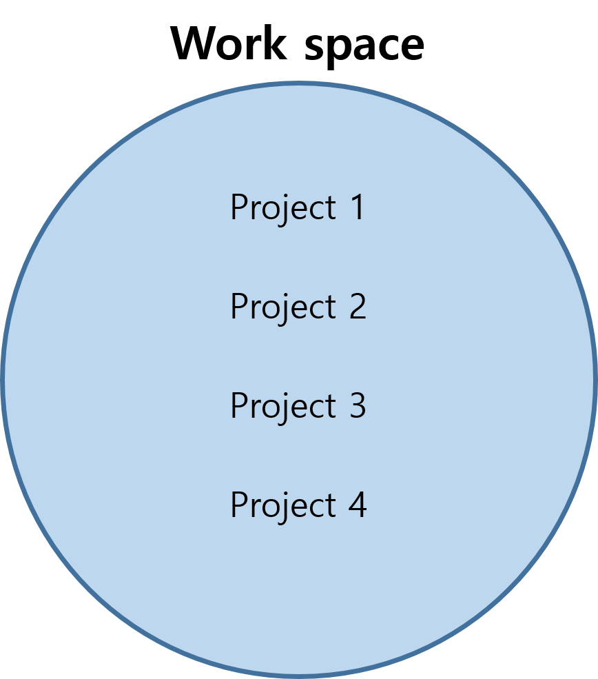

# JAVA란?

- JAVA는 동작 프로그램이랑 상관 없이 작동이 가능함
- windows와 mac os 모두에서 구동 가능
- 세계 1위, 이식성이 높다
- 모듈화가 잘 되어 있음
- 객체 지향 언어 --> OOP : 부품객체 first, 이를 조합하는 방식
- Garbage Collector : 쓰레기들을 자동 처리
- 다른데서 실행하려면 가상 머신이 필요. 그래서 웹 상에서 구동하는거(윈도우) 잘 안만듦 --> 웹서버, 어플에 주로 활용한다.


### eclipse 설치하기 

- eclipse 파일을 다운로드 받아 C드라이브에  'dev' 폴더를 만들어 복사. 폴더 내에서 압축 해제
- project explorer 창을 실수로 없애는 경우 
  - windows- perspective - reset 어쩌구로 창 다시 설정




## Eclipse JAVA 단축키

- `main + ctrl + space` : main 메소드 불러오기
- `syso + ctrl + space` : println 불러오기
- `shft + ctrl + c` 혹은 `ctrl + /` : 주석 처리
- `ctrl + F11` : 콘솔창에 출력
- `shft + ctrl + f` :  소스코드 정렬
- `ctrl+H` : search
- `ctrl + y ` : 되돌리기에서 돌아오기


## 1) 기본 출력과 연산

#### 1. 기본 출력

```java
package ch01;
public class Hello {
	//main ctrl+space
	//syso ctrl+space	
	public static void main(String[] args) {
		// 1번 - 숫자
		System.out.println(111);	
		// 2번 - 문자
		System.out.println('X');
		// 3번 - 문자열
		System.out.println("java 문자열");
		// 4번 - 변수
		int age = 30;
		System.out.println(age);
	}
}
```

#### 2. 따옴표와 연산

```java
package ch01;
public class Print {
	public static void main(String[] args) {
		// 더하기와 곱하기 연산의 경우 곱하기가 더 우선 순위로 연산
		System.out.println(1 + 3 * 4);
		// 괄호를 사용하면 최우선 순위로 연산
		System.out.println((1 + 3) * 4);
		System.out.println("큰따옴표 안에서는 '작은따옴표' 사용 가능");
		System.out.println("큰따옴표 안에서 \"큰따옴표\"를 사용하려면 예외문자(\\)를 사용");
		// 작은따옴표는 문자 한개를 표현할때 사용
		System.out.println('문');
		// 여러 기호의 조합
		System.out.println("A의 점수 합은 : " + (1 + 2) + ", B의 점수 합은 : " + (3 + 4));
	}

}

```

- 큰따옴표 내에서 큰따옴표를 사용할 때는 `\"` 로 쓴다.
- 작은 따옴표는 문자 하나를 쓸 때 사용해서 잘 안쓴다.

#### 3. 큰따옴표 응용

```java
package ch01;

public class Exam01_2 {
	public static void main(String[] args) {
		System.out.println("{\"id\":\"ggoreb\", \"pw\":\"abcd\", \"name\":\"kim\", \"age\":20}");
		int age = 20;
		System.out.println("{\"id\":\"ggoreb\", \"pw\":\"abcd\", \"name\":\"kim\", \"age\":" + age + "}");
	}
}
```

출력 결과

```shell
{"id":"ggoreb", "pw":"abcd", "name":"kim", "age":20}
{"id":"ggoreb", "pw":"abcd", "name":"kim", "age":20}
```


