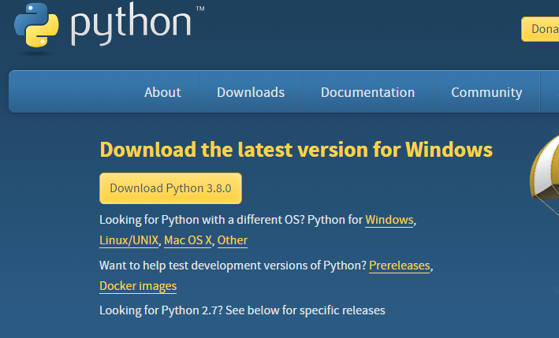

vscode에서 터미널 - 뉴터미널 

git bash로 바꾸고 완전히 kill terminal 후 다시 열어야 한다


ctrl shft p 를 통해 명령어 직접 입력으로 설정도 가능하다 

git init && git add . -동시 명령. 오타나면 ㅈ된다

---

# Python 기초

Life is short. You need Python. - Bruce Eckel

1. 쉽다
2. 많은 사람들이 사용한다
3. 많은 것을 할 수 있다


언어 = 약속


#### 프로그래밍 언어 : 3형식

1. 저장
2. 조건(if)
3. 반복(while)


시작하기 전에 

1. 대소문자
2. 띄어쓰기
3. 스펠링


## Python의 문법

### 1. 저장

> dust = 60 ; dust에 60을 저장한다
>
> dust == 60 ; dust와 60이 같다

#### 무엇을 저장하는가

1) 숫자

1. 현실 세계에 존재하는 모든 숫자(글자들어가면 안됨)
2. 기본적인 연산 가능 (계산기)

2) 글자

1. 현실 모든 글자 따옴표나 쌍따옴표로 감싸주기

3) 참/거짓

1. True, False 단 두가지. 앞글자 대문자
2. 조건/반복에 사용된다.


터미널에서 code python_basic.py 

python --version : 깔려있는지 확인




가운데꺼로 깔아주자

```python
number = 123
number_two = -456
number_three = 7.89
print(number)
print(number_two)
print(number_three)
print(number, number_two, number_three)
```

출력 결과

```shell
$ python python_basic.py
123
-456
7.89
123 -456 7.89


```

파이썬


```python
a = '가나다'
b = '123'
c = 123
print(a, b, c, 123)
print(type(b), type(c), type(123))

d = True
e = False
print(d, e, type(d), type(e))
```

출력결과

```shell
가나다 123 123 123
<class 'str'> <class 'int'> <class 'int'>
True False <class 'bool'> <class 'bool'>
```


주석처리는 #


python python_basic.py

```python
array = [1,2,3,4,5,6,"넷", "다섯", "여섯", True]
print(array)
print(array[0:3])
print(array[4:])
print(array[-1])
```

리스트에서 슬라이싱할때 대괄호

0번째부터 2번째까지 찍고 싶으면

```python
print(array[0:3])
```

음수의 경우 마지막 숫자를 이야기하는 것임

```python
print(array[-1])
```


출력결과

```shell
$ python array.py
[1, 2, 3, 4, 5, 6, '넷', '다섯', '여섯', True]
[1, 2, 3]
[5, 6, '넷', '다섯', '여섯', True]
True
```


3) 딕셔너리

궁극의 박스 dictionary

```python
dust = {'영등포구' : 50, "강남구" : 40}
print(dust['영등포구'])
dust_two = dict(영등포구 = 50)
print(dust_two)
```

딕셔너리활용

```shell
$ python array.py
50
{'영등포구': 50}
```

중괄호로 만들땐 키값은 반드시 string이어야 한다. 따옴표 있어야 한다.

함수 호출 형식으로 딕셔너리 만들때는 따옴표 없이 한다


```python
import random

coffee = ['아이스아메리카노', '뜨거운아메리카노', '카페라떼', '커피믹스', '핫초코']

co = random.choice(coffee)
print(co)
```

랜덤으로 리스트 내의 항목을 뽑아 내는 함수


```python
numbers = list(range(1,10))
print(numbers)
```


출력

```shell
[1, 2, 3, 4, 5, 6, 7, 8, 9]
```

이때 numbers라는 리스트의 type을 알고 싶다면

```python
print(type(numbers))
```

출력결과

```shell
<class 'list'>
```


점심메뉴에 따라 점심메뉴와 전화번호를 함께 표출하는 예제

```python
import random

# menu 리스트를 만들어주세요.
menu = ['20층', '양자강', '김밥카페', '순남시레기', '바나프레소']
phone_book = { '20층' : '010-1234-1234', '양자강' : '010-4433-3322', '김밥카페' : '010-1234-1334', '순남시레기' : '010-1234-1444', '바나프레소' : '010-1234-1554'}  

choice = random.choice(menu)
print(choice, phone_book[choice])
```

출력결과 (랜덤임)

```shell
양자강 010-4433-3322
```


### 2. 조건

if (True)

​	

```
a = 0
if a:
    print("0입니다")
else:
    print("아닙니다")
```

출력 결과 아닙니다

```python
a = 30
if a > 30 :
    print("30 이상입니다")
elif a <= 20 :
    print("20 이하입니다")
else:
    print("둘다아닙니다")
```

출력결과 둘다아닙니다


파이썬은 띄어쓰기 기준으로 인식하기 때문에 spaces: 4 기준으로 바꿔준다

스페이스바 네개 혹은 탭 한번

and 는 두 조건 모두 true일 때만 리턴

```python
n = 0
while n < 3 :
    n = n + 1
    print('출력')
```

출력 3번이 된다


```python
numbers = list(range(10))
print(numbers)
for number in numbers : 
    print(number)
```

출력 결과

```shell
$ python while_for.py
[0, 1, 2, 3, 4, 5, 6, 7, 8, 9]
0
1
2
3
4
5
6
7
8
9
```


