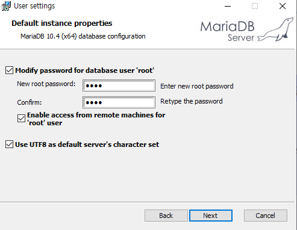
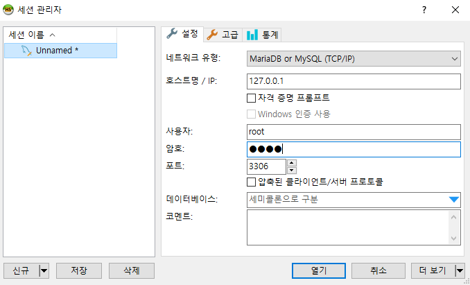

# 데이터베이스 소개

마리아 DB 설치

구글에 maria db 검색


다운로드

유명한 DB들

- MariaDB( = MySQL)
- Oracle
- MS-SQL


SQL(Structured Query Language) -  구조화된 쿼리 언어

요즘에는 ANSI SQL이라는 걸 많이들 공부한다. (미국산업표준)


WebServer(대표적으로 Spring)에 접속할 때는 Browser가 필요 한 것 처럼 DBServer(MariaDB 등)에 접속 할 때도 Tool이 필요. 

우리는 HeidiSQL을 사용할 것이다

Mac OS의 경우 WorkBench 사용..




```powershell
C:\Users\student>cd /

C:\>cd "Program Files"

C:\Program Files>cd "MariaDB 10.4"

C:\Program Files\MariaDB 10.4>cd bin

C:\Program Files\MariaDB 10.4\bin>mysql -u root -p
Enter password: ****

```

## Heidi SQL



신규 -저장

데이터베이스 이름은 한글은 쓰지마라..


## 데이터베이스란

- DBMS (DataBase Management System)

- 여러 사람들이 공유하고 사용할 목적으로 통합 관리되는 정보의 집합

- 엑셀 같은거보다 공유가 용이

- 파일 시스템의 문제 ( 여러사람이 동시에 수정할 수 없다, 삭제수정을 잘못하는 경우 돌이킬 수 없다 등)를 해결하기 위해

- 주요 기능 

  - 정의(DDL) : 데이터베이스 구조를 정의하거나 수정

  - 조작(DML) : 데이터 삽입 / 조회 / 수정 / 삭제 작업

    Create

    Read

    Update

    Delete

  - 제어(DCL) : 데이터를 항상 정확하고 안전하게 유지... 이 부분은 우리는 다루지 않을 것

#### 관계형 DBMS

- 테이블 형태로 구성
- 오라클, MySQL 등


### 데이터 모델링

#### 데이터 모델링

- 현실 세계에 존재하는 데이터를 컴퓨터 세계의 데이터베이스로 변환하는 과정


실행창에서

services.msc 실행하면 서비스 확인할 수 있는 창이 나온다

서비스 끄고 싶으면 m을 눌러 mariaDB를 검색한 후 하면 됨..

### Key (키)

- 후보키 : id가 될만한 후보군(유일성과 최소성 만족)을 후보키라 한다.
- 기본키 : 후보키 중에서 기본적으로 사용하기 위해 선택한 키

- 대체키 : 기본키를 하나 선정하면  id가 될만한 다른 후보군은 대체키가 된다

- 슈퍼키 : 기본키, 대체키, 후보키는 유일성과 최소성을 만족한다. 하지만 슈퍼키는 유일성만 만족하는 집합임
  - 나이 + 주소 처럼 다양한 속성을 조합한다든지...
- 외래키 : 다른 테이블에서 끌어다 쓰는 아이디... 

#### 개체 무결성 제약 조건

- 기본키를 구성하는 모든 속성은 NULL 값을 가질 수 없다

#### 참조 무결성 제약 조건 

- 기본키로 존재하지 않는 녀석은 외래키가 될 수 없다

- 기본키가 존재해야 외래키도 존재

- 기본키를 삭제할 때는 외래키도 같이 삭제 해주어야 한다


