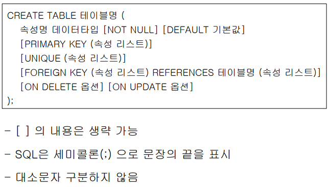
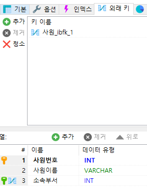
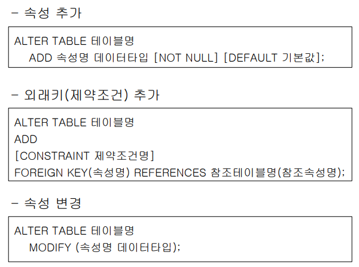
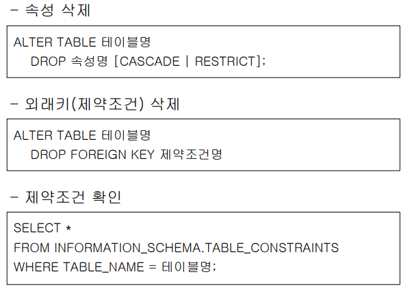

# Create / Alter

## SQL(Structured Query Language)

> 구조를 가진 질의어.
>
> 관계형DB를 위한 표준 질의어

`services.msc` - 컴터에서 동작하는 여러 서비스 형태 확인 가능

- DDL - 공간할당
- DML
- DCL

## DDL

### 1. 테이블 생성 : `CREATE TABLE [테이블명]`

- 

- 프라이머리 키는 주는 것을 권장함

- 유니크 키를 주는 경우 그 컬럼에 대해서는 중복을 허용하지 않게 됨

- ```mysql
  CREATE TABLE 연습(
   NUM INT,
   NAME VARCHAR(10),
   AGE INT,
   EMAIL VARCHAR(50),
   PHONE VARCHAR(20),
   PRIMARY KEY(NUM)
  );
  ```

- CTRL +F9

### 2. 테이블 제거: `DROP TABLE`


현재쿼리 실행 == 현재 커서가 있는 위치


CONSTRAINT 제약조건명은 숫자로 시작되면안된다

주가 되는 것은 변하지 않는 '부서' 

직원들은 각 부서의 번호를 부여 받는 것이라 이해

1대 多 에서 多에 해당하는 테이블이 외래키를 쓴다



초록열쇠가 외래키

```mysql
 FOREIGN KEY(소속부서) REFERENCES 부서(부서번호)
```

### 3. 테이블 변경 : `ALTER TABLE`

- 
- 

```mysql
CREATE TABLE MEMBER(
 NUM INT,
 NAME VARCHAR(10),
 AGE INT,
 EMAIL VARCHAR(50),
 PHONE VARCHAR(20),
 PRIMARY KEY(NUM)
);
```


```
ALTER TABLE MEMBER
	DROP AGE;

ALTER TABLE MEMBER
	MODIFY EMAIL VARCHAR(100);
	
DESC MEMBER;
```


### 4. 외래키  설정하기 : REFERENCES

외래키 설정 시 원래 기본키의 크기와 같게 지정해주는 게 좋다

```mysql
ALTER TABLE 연습
	ADD 대상 VARCHAR(20);
	
ALTER TABLE 연습
	ADD FOREIGN KEY(대상)
	REFERENCES 연습1(이메일);
```

### 5. 제약조건 변경하기

외래키는 변경이 불가능해서 삭제하고 입력해야한다

```mysql
--제약조건 명칭 조회
SELECT * FROM information_schema.TABLE_CONSTRAINTS
--EMP_IBFK_1 제약조건 명칭

--제약조건 삭제
ALTER TABLE EMP DROP FOREIGN KEY EMP_IBFK_1;

--제약조건 입력
ALTER TABLE EMP ADD
	CONSTRAINT FK_EMP_DEPT
	FOREIGN KEY(DEPTNO) REFERENCES DEPT(DEPTNO)
	ON DELETE CASCADE
```

