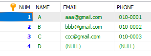
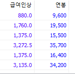

# Insert / Select

## 데이터 삽입 : INSERT

- INSERT INTO 테이블명 [(속성 리스트)] VALUES (속성의 값 리스트);


DB에서는 작은 따옴표를 무조건 써야 한다

```mysql
INSERT INTO 부서 (부서번호, 부서이름) 
	VALUES (1, '홍보부');
```


```mysql
INSERT INTO MEMBER (NUM, NAME, EMAIL, PHONE)
VALUES (1, 'A', 'aaa@gmail.com', '010-0001');

INSERT INTO MEMBER (NAME, EMAIL, NUM, PHONE)
VALUES ('B', 'bbb@gmail.com', 2, '010-0002');

INSERT INTO MEMBER (NUM, NAME, EMAIL, PHONE)
VALUES (3, 'C', 'ccc@gmail.com', '010-0003');

INSERT INTO MEMBER (NAME, NUM)
VALUES ('D', 4);
```



기본키 지정이 되어 있기 때문에 중복 데이터가 들어가려 하면 에러가 뜬다


## 데이터 조회 : SELECT

>  SELECT [DISTINCT] 속성 리스트 FROM 테이블 리스트

- 속성 리스트 나열하기 귀찮으면 *로 대체 가능
- `SELECT * FROM 고객;`
- `DESC 고객;` - 속성 리스트를 확인

### 1. 중복데이터 걸러내기 : DISTINCT

중복데이터를 걸러내고 하나씩 데이터를 출력하려면 DISTINCT를 활용한다

```mysql
SELECT DISTINCT (제조업체) FROM 제품;
SELECT DISTINCT 제조업체, 제품명 FROM 제품;
```


### 2. 속성명 변경 출력 : AS

- SELECT 속성명 [AS] 변경속성 FROM 테이블
- 테이블이 가진 기존 속성명을 지정한 속성명으로 변경하여 출력 가능

- [AS] 생략하고 띄어쓰기로 구분해도 가능

- ```mysql
  SELECT 제품명, 단가 AS '가격' FROM 제품;
  
  SELECT DISTINCT DNAME AS '부서명', LOC AS '부서위치' FROM DEPT;
  ```

  

### 3. 산술식 이용하기

- ```mysql
  SELECT 제품명, 단가, 단가+500 AS 조정단가
  	FROM 제품;
  	
  SELECT SAL*1.1 AS '급여인상', SAL * 12 + IFNULL(COMM, 0) AS '연봉' FROM EMP;
  # IFNULL 함수 맛보기
  ```

- 

### 4. 조건에 해당하는 데이터 검색 : WHERE

- SELECT [DISTINCT] 속성 리스트 FROM 테이블 리스트 [WHERE 조건];
- SELECT에는 WHERE이 필수적으로 따라온다고 생각할 정도로 많이 사용
- 데이터베이스에서 `=`은 대입이 아닌 같다는 것을 의미한다

```mysql
SELECT 제품명, 재고량, 단가
FROM 제품
WHERE 제조업체 = '한빛제과';

# 제조업체가 한빛제과인 제품을 출력하겠다

SELECT * FROM 주문
	WHERE 수량 >= 30 AND 배송지 = '강원도 춘천시';
```

- BETWEEN 을 통해 범위를 지정해 주는 것도 가능하다

  ```mysql
  SELECT 제품명, 단가, 제조업체
  FROM 제품
  WHERE 단가 BETWEEN 2000 AND 3000;
  ```

- 괄호로 묶어주는 것도 가능

  ```mysql
  SELECT * FROM EMP WHERE (MGR = 7698 OR MGR = 7839) AND DEPTNO = 10;
  ```

- 괄호가 없는 경우 OR을 기준으로 앞 뒤로 분리가 되기 때문에 결과가 다르게 나타난다


### 5. 부분적으로 일치하는 데이터 검색 : LIKE

- 데이터를 검색 할 때 LIKE는 필수다. 이거 안쓰면 정규식의 MATCH와 같은 기능밖에 하지 못한다.

- `%` : 뭐가 오든 아무것도 오지 않든 상관없다는 의미. 정규식의 *과 비슷.

- `_` : 언더스코어를 쓰면 이 개수 만큼의 문자 길이의 문자열 검색

- ```mysql
  #직업이 세글자 , 아이디에 A포함하는 사람 찾기
  SELECT * FROM 고객 WHERE 직업 LIKE '___' AND 고객아이디 LIKE '%a%'
  
  #사원명의 2번째 글자에 'I'가 있는 사원명과 급여 검색
  
  SELECT ENAME, SAL FROM EMP WHERE ENAME LIKE '_I%';
  ```


### 6. NULL 데이터 검색 : IS NULL / IS NOT NULL

- NULL은 실행 명령을 자꾸 무시해버리기 때문에 제어해줘야 하는데 이때 `=` 기호를 사용하면 안된다. `IS`를 써야 함.

  ```mysql
  SELECT * FROM 고객 WHERE 나이 IS NULL;
  
  SELECT * FROM 고객 WHERE 나이 IS NOT NULL;
  ```

- LIKE와 함께 활용

  ```mysql
  SELECT * FROM EMP WHERE COMM IS NOT NULL AND HIREDATE LIKE '1981-02%';
  ```

  - 2월 이후 입사 한 사람을 찾기 위해서는 `HIREDATE > '1981-02';`라고 활용도 가능하다


### 7. 데이터 검색 후 정렬 : ORDER BY

> SELECT [DISTINCT] 속성 리스트 FROM 테이블 [WHERE 조건] [ORDER BY 속성 리스트 [ASC | DESC]];

- 데이터베이스는 데이터의 순서를 정하지 않는다. 이 때 우리가 원하는 순서로 지정하고 싶을 때 OREDER BY를 활용

- 오름차순 : ASC, 내림차순 : DESC

```mysql
SELECT 주문고객, 주문제품, 수량, 주문일자
FROM 주문
WHERE 수량 >= 10
ORDER BY 주문제품 ASC, 수량 DESC;
```

- 오름차순 - 

### 8. 출력 개수 제한 : LIMIT

- ```mysql
  SELECT * FROM EMP
  	LIMIT 0, 5; --INDEX 0번 부터 ~ 5개를 출력한다는 의미
  
  ```

- SELECT 순서 체크

  ```mysql
  SELECT * FROM EMP WHERE DEPTNO = 30 ORDER BY SAL DESC LIMIT 0, 5;
  SELECT * FROM EMP WHERE DEPTNO = 30 ORDER BY SAL DESC LIMIT 5, 5;
  ```

  