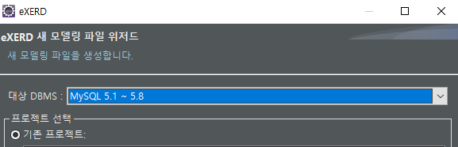
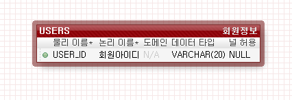
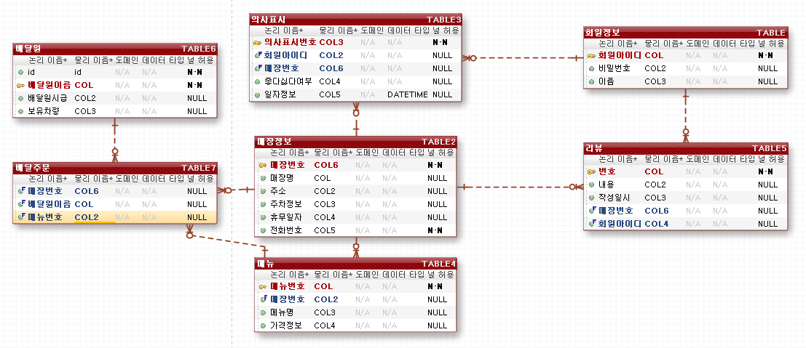
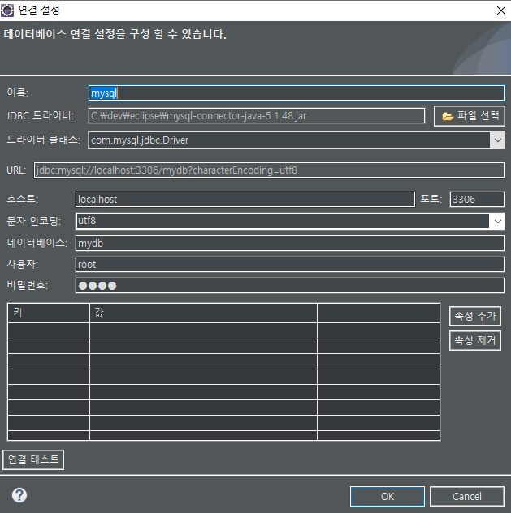

# 데이터베이스 설계

### 설계 과정

1. 요구 사항 분석
   - 데이터베이스의 용도 파악
2. 개념적 설계
   - 대충 무엇이 필요하겠다... 백지 상황에서 밑그림을 그려가는 개괄적인 설계단계
   - E-R 다이어그림으로 표현
3. 논리적 설계
4. 물리적 설계
5. 구현

### ERD 프로그램

플러그인방식도 있고 설치방식도 있음

#### 1. exerd 다운받기

플러그인 방식의 것을 설치..!

#### 2. 테이블 만들기

요런식으로 만든다

일대다 관계에서 다쪽에 외래키가 들어간다

#### 3. 내보내기

WINDOWS- PREFERENCES- eXERD-DBMS

포워드엔지니어링 시 이름 앞에 스키마 표시 없애기

빨간점선- 비식별관계로 키 만들고(외래키)

- 비식별관계는 외래키로 사용되는 곳에서 기본키로 데이터를 찾아낼 수 없다는 의미
- 식별이란 정확하게 하나를 끄집어내는 것을 말한다...
- 이 상태에서 외래키를 PK(PRIMARY KEY)로 설정하면 녹색실선이 된다... 이때 외래키가 있는 곳에 기존 기본키가 있는 경우 완전한 식별관계가 아니다... 버뜨 ERD 세계에서는 이 경우에도 식별관계라고 한다

녹색실선- 식별관계로 키를 만든다

- 원래 정의는 외래키가 기본키로 지정되어 '식별'이 가능한 상태를 말하는 거임

### 정규화

정규화는 보통 여러 사람이 의논을 통해 하게 됨

