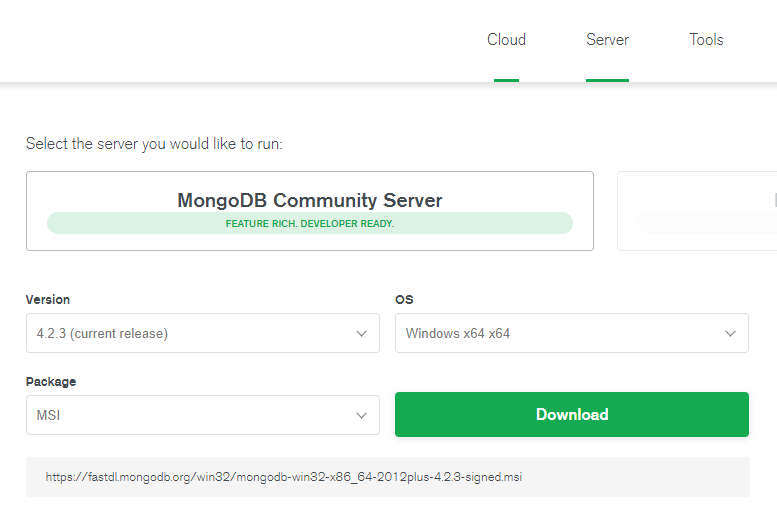
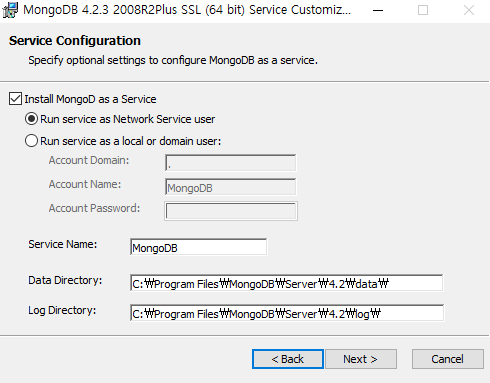
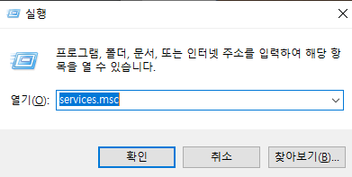
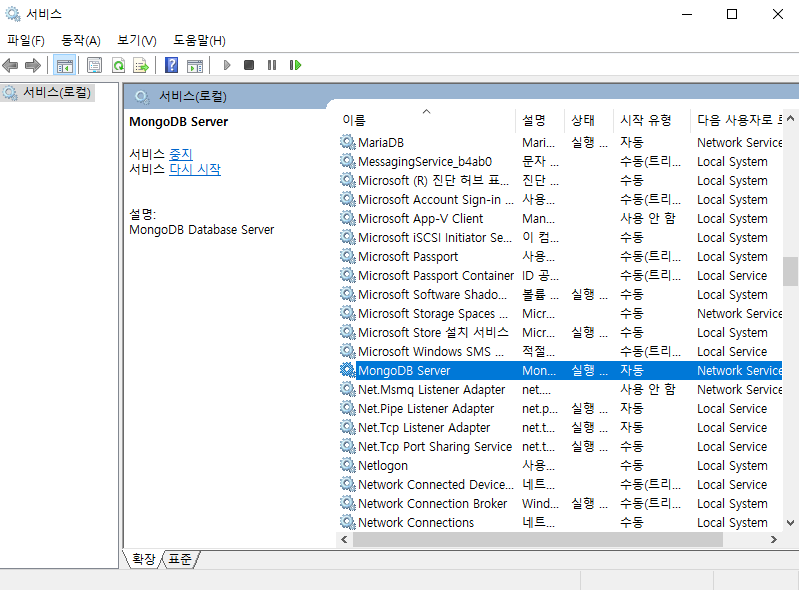
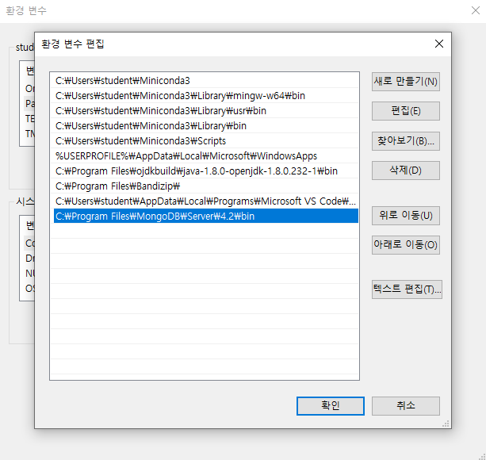

기존 rdbms(mysql)은 매일 발생되는 데이터들이 무거워져서 용량문제 발생. 쌓인 데이터들을 조회할 때 접근 시간이 오래 걸린다는 문제 발생. 

nosql은 하나의 컴터 뿐만 아니라 여러 컴퓨터를 연결(토렌트와 같은 방식)하여 한 대상 뿐만 아니라 여러 대상을 찾아 낸다. 파일 전체를 0-1000이라고 봤을 때 누구한테 1을 가져오고 누구한테는 4-5개를 가져오는 등 그 때 그때 상황에 따라 받아오는 것을 달리 할 수 있게

한 서버에서만 가져오는게 아니라 아주 유연하게 대처가 가능하다는 장점. 클라우드 환경스럽게 구축 

권장하는 시스템 수는 홀수. 3개 5개 등. 홀수여야 얘네가 만들어 둔 기능을 제대로 적용해볼 수 있다. 

단점- 서버 중 하나가 죽어도 죽은 것을 바로 확인할 수 없다. 이 서버가 다운된 건 줄 모르고 데이터를 넣는 것을 시도......... 데이터를 잃어버릴 수 있다는게 치명적 단점 있음

유용한 경우 

- 많은 양의 데이터를 마구마구 집어 넣을 때 
- 아주아주 중요한 데이터가 아닐 때 
- 이런 비정형데이터들을 다 때려 넣을 때

### 샤드

유리조각을 의미 shard

데이터를 분할시켜 저장

복제본은 레플리카

### 종류

#### nosql의 key/value store

자바의 맵

자바스크립트의 제이슨

파이썬의 딕셔너리 형태임

- 대표적으로 Redis

#### Ordered Key / Value Store

#### Document Key / Value Store

- 대표적으로 몽고DB

#### Graph Store

- 그래프 기반의 저장소...
- Neo4j

## MongoDB

- 스키마가 고정되지 않아 다양한 형태의 데이터 저장이 가능
- join이 불가능. 정규화 개념 없음
- 데이터가  입력이 되면 그 상태를 메모리에 올려두기 때문에 메모리를 많이 쓴다. 메모리가 크면 클 수록 성능이 좋아진다
- 관계나 트랜잭션이 중요한 금융 / 결제 / 게시판 등의 서비스에는 부적합

### Document Data Model

- 무조건 중괄호로 시작하고 끝이난다.
- 물론 중간에 대괄호가 올 수 있긴 함.
- join이 안되기 때문에 게시글의 댓글이란 개념을 추가하기 위해서는 그 내용을 모두 집어 넣어야 함

### mongodb 설치

- https://www.mongodb.com/download-center/community
- 

여기서 m 써보면 db 실행 중인거 확인가능

컴터 버벅거리는거 싫으면 실행 중지

### 환경변수 등록하기

- 시스템 -> 고곱시스템설정->환경변수->path 항목에 경로추가

- MongoDB/bin
- 

### find

find는 여러건 조회

findone은 한건조회

대괄호를 가진 녀석을 수정할 때는 set이 아니라 pull과 push를 활용한다

## index

색인이 지정되어있으면 찾아가기 쉽다

목차 같은 성격

데이터가 빈번하게 삭제되거나 수정될 경우 인덱스가 있으면 과부하...

인덱스는 늘 최신 상태로 동기화 해주어야 하기 때문

