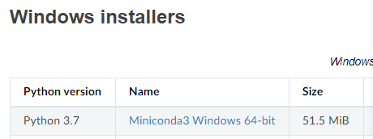
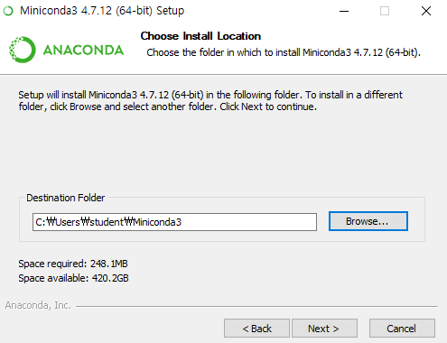
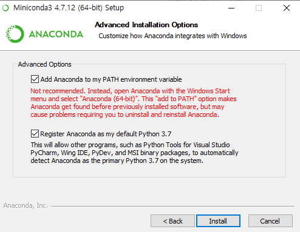
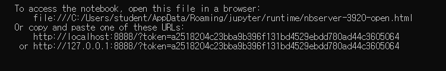
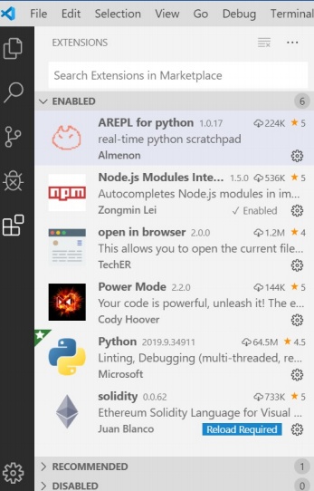

# Python

파이썬 3.8.0을 지울 것이다.

아나콘다를 받을 것이다.

#### Anaconda

- 이걸 받으면 최대 장점 - 파이썬 버전에 맞는 virtual environment(가상환경)를 만들어 사용이 가능하다

- 최대 단점은 용량이 개크다는 것임. 기본적으로 1기가는 넘고 10기가가 넘어가게 될 수도 있음

- 참고맙게도 Anaconda가 용량이 넘 커서 Miniconda를 깔면 300-400mb 정도의 용량이 나온다. 고로 우리는 미니콘다를 설치할 것이다. 
- 하나의 언어라 생각


코드 작성은 중요치 않다고 했지? 아키텍쳐의 관점으로 봐야한다 -김남현-


## Miniconda 설치하기

### 1. 설치 파일 다운

- miniconda 검색하기



- 다운받기



- 한글명 폴더에 설치하지 마라



- 상단 체크박스 꼭 체크해주어야 한다. 이거 체크 안하면 환경변수를 따로 설치해주어야 함.

### 2. jupyter notebook 설치하기

- cmd 창에서 `conda install jupyter` 실행

- 설치 완료 후 cmd 창에서 `jupyter notebook` 실행

- 또는 

  cmd창에 뜬 url을 복사해서 열 수도 있다.

- 주피터노트북은 패스 설정된 곳에서 기본으로 열린다

- 주피터노트북 끌 때는 그냥 웹창 다 끄고 cmd 창에서 `ctrl + c`를 통해 종료

  


## 파이썬이란

- 프로그래밍 언어는 두가지 종류가  있는데 컴파일러와 인터프리터가 있음. 파이썬은 인터프리터

#### 컴파일러

- 컴파일러는 빠르고 모든 명령을 일괄 번역하여 실행하지만 구조가 복잡하고 어려움
- c/c++/c#/Java/Go

#### 인터프리터

- 명령어 만날 때마다 즉시 번역하여 실행
- 속도는 느리지만 단순하고 쉽다
- 자바스크립트/Ruby/Python 등

### 파이썬의 활용분야

- 데이터 분석
- 인공지능
- 웹 애플리케이션 
- 코딩 교육 

### 개발환경

- 주피터 노트북과 VS Code를 사용할 것이다


### VS Code에서 확장기능 추가 설치



- AREPL이랑 solidity를 다운

- 버전 확인

  ```shell
  C:\Users\student>python --version
  Python 3.7.4
  
  C:\Users\student>conda --version
  conda 4.7.12
  ```


### 가상환경

- 가상환경이란 라이브러리마다 맞는 버전을 일일이 맞추기위해 패키지를 지웠다 설치했다하기 귀찮기 때문에 이를 해결하기 위한 것임
- 독립적인 하나의 '폴더'를 만들어내는 느낌~
- 만들면 만들수록 용량 엄청나진다. 적당히하자

#### 가상환경을 만드는방법

1. 파이썬의 기능을 이용해서 만든다 : 현재 파이썬의 버전을 그대로 가져가야하게 된다

`-m venv test-ven`

2. 현재 경로와 상관 없이 아나콘다 설치 디렉토리의 envs 디렉토리에 생성한다 : 우리는 이거 쓸거임

   

### 아나콘다로 가상환경 만들기

- cmd 창에서 `conda create --name myenv`를 통해 가상환경 만들기
- 가상환경 실행하고 나오는 법

```shell
Preparing transaction: done
Verifying transaction: done
Executing transaction: done
#
# To activate this environment, use
#
#     $ conda activate myenv
#
# To deactivate an active environment, use
#
#     $ conda deactivate
```

- 가상환경에 설치된 패키지들 확인하기 위해서는 `conda activate [가상환경명] 으로 실행한 다음` `conda list`로 확인

- 가상환경 탈출시

  ```shell
  (myenv) C:\Users\student>deactivate
  ```

#### 아나콘다에서 패키지 관리하기

- 아나콘다 conda 명령어 사용

- 현재 환경 정보 : `conda info `

- 검색 : `conda search [패키지명]`

- 설치

  - `conda install [패키지명]`

  - `conda install [패키지명]=[버전]`
  - `conda install [패키지명]=[버전]=[파이썬버전]`

- 업그레이드 : `conda update [패키지명]`

- 삭제 : `conda remove [패키지명]`

- 설치된 목록 확인 : `conda list --export > [text 파일명] `

- 목록으로 설치 :` conda install --file [text 파일명]`


### Jupyter notebook 사용하기

1. for each 방식을 사용하는 파이썬

- 가지고 있는 요소를 하나씩 뽑아내는 개념

  ```python
  for i in range(1,11):
      print(i)
  ```

  run 클릭 혹은 `shft+enter`실행 단축키


