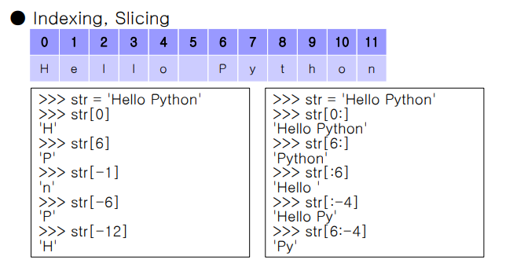

# 자료형_변수

### 자료형

1. 숫자(Number)-자바와 달리 정수와 실수로 구분되지 않는다
2. 문자(String)-자바와 달리 한글자다 여러글자다 구분하지 않는다
3. List- 보통 리스트를 하나 만들어 놓고 그 데이터를 참조하기 위한 용도로 사용하는 경우가 많긴함. 그래도 변경 삭제가 가능한 녀석
4. Tuple은 거의 사용하지 않을 것이다. 얘넨 변경도 삭제도 안된다.
5. Dictionary : 자바의 map임... 또 다른 언어에서는 table이라 부르기도
6. Set : 중괄호 내의 값인데... 집합이다. 중복데이터를 허용하지 않는다.? 
7. 논리(Boolean or Bool) - 첫 글자를 대문자로 쓰는 것이 특징 - True, False


숫자는 걍 다 표현 가능하다. 

지수 표현에는 알파벳 e가 중간에 들어가는 것이 특징

16진수에서 10을 표현할 수 없어서 0xA로 표현함


파이썬에서는 바꾸고자하는 자료형태로 감싸주면 바뀐다



완전 유용

```python
 date = '2012 03 25'
print(date[0:4])
print(date[5:7])
```


command모드 (초록모드에서 esc 누르면 바뀌는 파란모드)에서 h를 누르면 단축키를 볼 수 있다.


주피터노트북은 한행한행이 단독으로 실행되기 때문에 왔다갔다가 가능함

행 삭제 - `dd`

행 위아래로 행 추가 - a 혹은 b


ctrl+enter 실행

shft+enter실행후 다음꺼

alt+enter 실행후 다음 행 에딧모드

쩜 찍고 탭치면 사용가능한 함수 볼 수 있다

sft+tab 함수에 대한 설명 보고싶다


formatting 개념

### tuple

tuple의 특징 = 요소가 한개인 경우 반드시 쉼표를 붙임

요소가 여러개인 경우 괄호를 생략해도 됨.

요소 수정 및 삭제가 불가능하다

### Dictionary

>  자바에서 map을 활용해봤다면 이해가 잘 될 것
>
> json을 이해한다면 완벽ㅇㅣ해!

- 중복값은 허용하지만 중복키는 허용하지 않는다
- 딕셔너리명 =  { 키1:값1, 키2:값2, 키3:값3, … , 키N:값N }

- 딕셔너리에 '가'라는 키값을 가진 '파이썬'이라는 값을 넣고 싶다면

```python
dict['가'] = '파이썬'
```


