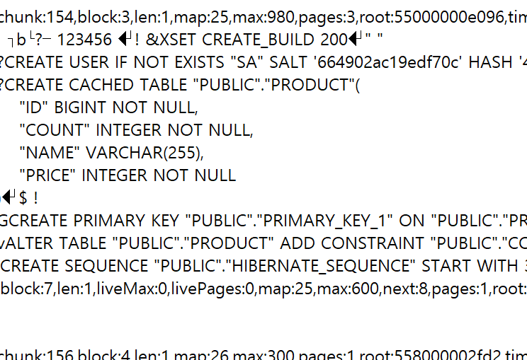

# 입력출력


띄어쓰기와 더하기로 넣을 때는 앞 뒤 같은 자료형이 와야 한다. 콤마는 통일해주지 않아도 된다


input- string 형태로 받는다. 안내문구를 넣을지 여부

메모장 파일의 숫자들을 불러와서 합을 구하기

```python
f = open('c:/dev/04_03_numbers_data.txt', 'rt', encoding = 'utf8')

data = f.read()
print(data)
datas = data.split('\n')
print(datas)
f.close()

total = 0
for t in datas:
    total += int(t)
print(total)
```

메모장 파일의 글자들을 불러와 t가 들어간 단어를 찾기


end=' '를 쓰면 그 다음 줄로 쓰여지는 것이 아니라 그 옆에 이어서 출력이 된다


### 파일

내가 파일에 내용을 쓰고 싶든 읽어오고 싶든 

슥삭 다 밀어버리고 쓰든 등등 일단은 파일은 열어야 한다

그렇기 때문에 open()을 쓴다


`open('파일명', '모드(지정하지 않아도됨)')`

모드- 읽기모드/ 쓰기모드

텍스트모드/바이너리모드


열고 읽었으면 닫아줘야 한다

file.close()

안 닫아주면 계속 열고 있기 때문에 탐색기 상에서 수정이 안되는 등의 오류가 난다

#### 바이너리 모드

파이썬이 실제 메모리에서 처리하기 위한 리스트 형태를 유지해서 쓰기 위해 사용

메모장으로 표현하는 순간 이건 문자열이 되어버린다. 그럼 이걸 읽어와도 문자열이겠지요? 



메모장으로 열면 이렇게 보이는게 바이너리 형식이다.

포토샵이 비싼 이유...! 포토샵 사고 싶다 엉엉

TMI) 이런 형식이 요즘 오픈소스 잘 되어있어서 MSOffice말고 리브레오피스 등등 활용할 수 있다. 무료라고 한다. 성능은 모름...


#### 피클 (pickle)

> 바이너리 모드의 허접성을 보완하기 위해 나온 엄청나게 유명한 라이브러리

딕셔너리, 셋, 튜플 등은 텍스트형태로 저장이 안된다.  후루룩 저장한다고 하더라도 다시 뽑았을때 제구실을 못하게 된다. 


### 읽기

#### read()

모든 내용을 다 읽는다. 줄바꿈 문자까지 모두 포함하여 통째로 문자열로 가져온다

#### readline()

1. 줄바꿈 문자까지 한줄씩 가져오는 거임

2. 혹은 읽어와서 읽어온 문자열이 홀수값을 가지면 종료시킨다

   ```python
   file = open('c:/dev/gugudan.txt') # rt 기본값이 됨
   while True:
       data = file.readline()
       if not data:
           break
       print(data, end='')
   file.close()
   ```

   - 파일 안에 \n이 되어 있기 때문에 print할 때 end=''를 통해 줄바꿈을 하지 않아야 한칸씩 떨어진다

#### readlines()

통째로 가져오되 줄바꿈 문자를 기준으로 모든 내용을 리스트 요소로 생성! 리스트 형태!

```python
file = open('c:/dev/gugudan.txt') # rt 기본값이 됨
data = file.readlines()
for d in data:
    print(d, end='')
file.close()
```

- 얘네도 마찬가지로 줄바꿈을 가져오기때문에 end


### 파일내용 중 현재 위치

#### tell()

파일 내용 중 현재 위치 확인

#### seek()

파일내용 중 현재 위치 변경


### 자동 close

#### with file:

요즘은 이 방식을 사용하도록 권장한다

```python
file = open('c:/dev/gugudan.txt') # rt 기본값이 됨
data = file.readlines()
with file:
    for d in data:
        print(d, end='')
```

- close()가 들어가는 라이브러리들은 거의 이 with 활용이 가능

  

### with......... 머냐 어렵다 + 클래스

__ : 더블언더스코어(줄여서 던더스코어)

```python
class MyFile:
    def __init__(self):
        print('생성')
    def __enter__(self):
        print('enter')
    def __exit__(self, type, value, traceback):
        print('exit')
```

이렇게 클래스 만들어두면


```python
m = MyFile()
with m:
    pass
```

이걸 통해 열고 닫으면

```shell
생성
enter
exit
```

이렇게 자동으로 호출되면서 출력이 된다


