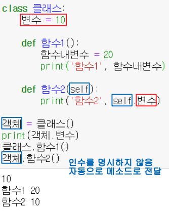
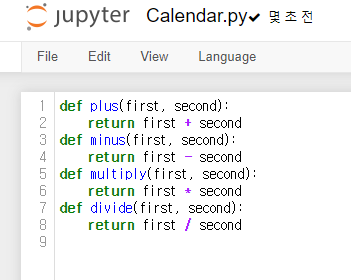
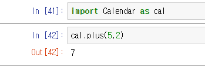

# 클래스

> 객체지향의 가장 기본적 개념
>
> 현실세계에 존재할 수 있는... 존재 하든 할 수 있든 그런 것들을 프로그래밍 코드로 나타낸 것들이다
>
> 시계... 동물... 닝겐...

- 만들어놓고 사용할 때 : 컴퓨터 메모리 상에 이 코드들을 만들어 준다. 

- 참조 자료형이다... 변수를 만들어 줄 때 그 주소값을 저장하는 것... 
- 클래스에는 전역변수들과 함수들이 들어 갈 수 있다. 전자렌지의 버튼은 변수. 눌렀을 때 동작하는 것은 함수.
- 이 메모리에 층층이 만들어진 클래스를 사용하는 것 
- 파이썬에서는 클래스의 변수를 활용하려면 반드시 self 선언해주어야 한다.
  - 이때 이 self(결국 이것도 변수)는 굳이 self라고 적을 필요는 없으나 일반적 개발자들은 다 이렇게 쓴다.

### 캡슐화

동사무소에 가서 이름을 바꿀 수 있게 만들어둔 제도처럼 함부로 변경이 불가능하게 해 둔 장치

### 멤버

전역변수와 함수들... 



- self냐 self가 없냐에 따라 달라지는 방식 참고


클래스를 만들어야 라이브러리 형태를 만들 수 있다

분업 협업 유지보수를 위해 어쨌든 써야한다


## 상속

> 부모가 가진 기능을 자식이 물려받는 것이다/
>
> 사람과 달리 물려주고 싶은 것만 물려주는 게 아니라 내가 가진 모든 것(변수 함수 등)을 모두 물려준다

- 부모 코드를 수정하면 아들 코드들도 자동으로 반영이 된다는 것임
- 단순히 기능을 물려받는 것이 아니라 '개념'을 물려받는 것
- 상속 후 기능을 추가(메소드)하는 것도 가능하다


#### `__init__` 

- 현 클래스를 메모리에 생성시켜주는 순간 자동호출하는 것임. 만들어지면서 호출되는 함수다.
- 그래서 "생성자"라고 부른다.
- 단순히 클래스 바로 아래에 변수를 만들면 기본자료형일 경우 따로 쓰지만 참조자료형일 경우 그것을 다른 객체들과 공유하게 됨. 그래서 이닛 안에 전역변수를 넣어주는 것이다.


#### 오버라이딩

- 부모가 가진 기능 요소(함수)를 뜯어 고치는 행위


## 모듈

- 라이브러리랑 비슷한 개념이라 보며 된다
- import한 이름 그대로를 넣고 쩜 하고 쓴다
- 파일명이 길면 앨리어스를 사용해준다(별명으로)


#### 모듈만들어서 불러오기





- 파일명 바꿔주는 것도 가능 (as)

- 이런 방식도 가능

  ```python
  from Calendar import minus
  minus(4, 2)
  
  from random import randint
  randint(1,3)
  ```


내가 주가 되어 실행할 때. 내가 직접 실행할 때만 동작 되어라 라는 의미...테스트해보기 위해. 모듈을 가져다 쓰는 사람에게서는 동작이 되지 않게 하기 위한 것임

```python
if __name__ == '__main__':
```


## 패키지

개발자들이 자신들만의 방식으로 파일을 정리하는데 이걸 패키지라고 함. 모듈의 확장판 같은 느낌~


`__init__` 파일의 기능