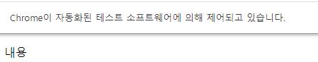

# 크롤링

==스크래핑, 게더링.. 

편하게 데이터를 가져오는 것. 데이터를 가져와 데이터베이스에 잘 연결해서 저장하는 단계까지


- 절차
  1. 원하는 **URL(Uniform Resource Location)**에 request를 보내고 결과를 받는다
  2.  받은 결과물(HTML / JSON / XML)을 파싱(Parsing)한다
  3. 필요 정보만 추출
- 파이썬 크롤링을 하기 위해 필요한 라이브러리
  - 데이터 통신 : requests / urllib / urllib2 (데이터 가져오기 용)
  - 파싱 : bs4 (BeautifulSoup) (파싱용)
  - 셀레늄...은 데이터를 가져오면서 파싱도 하는 용도. 매크로의 역할을 한다


뷰티풀숲 설치 - `conda install beautifulsoup4`

뷰티풀숲에서 html형태를 파싱할 때

```python
from bs4 import BeautifulSoup
soup = BeautifulSoup(result, 'html.parser')
```

태그 안에 있는 텍스트만 뽑아내기 = `.getText()`


유툽은 이제 사이트 개편이 되어 요걸로 뽑지 모대


## selenium

> 브라우저 자동화 라이브러리

자바스크립트 등을 크롤링하기 위한,,

1. 파이썬 라이브러리 셀레니움을 설치

    https://selenium.dev/selenium/docs/api/py/index.html 

2. 사용할 브라우저의 드라이버라는 프로그램 다운
3. 주피터의 경로와 같게설치


```python
from selenium import webdriver as wd
driver = wd.Chrome(executable_path='chromedriver.exe')
```


wait

- 브라우저에 HTML 요소가 보여진 후 코드 실행

  explicit 과 implicit


셀레니움으로 가져온 문자열을 뷰티풀 숲으로 넘겨주고 파싱을 하는게 일반적이다.





화면이 열리는걸 안보이게 하려면 phantomjs를 쓴다

-설치. install

이것 역시 주피터 있는 곳으로 ㄱㄱ

