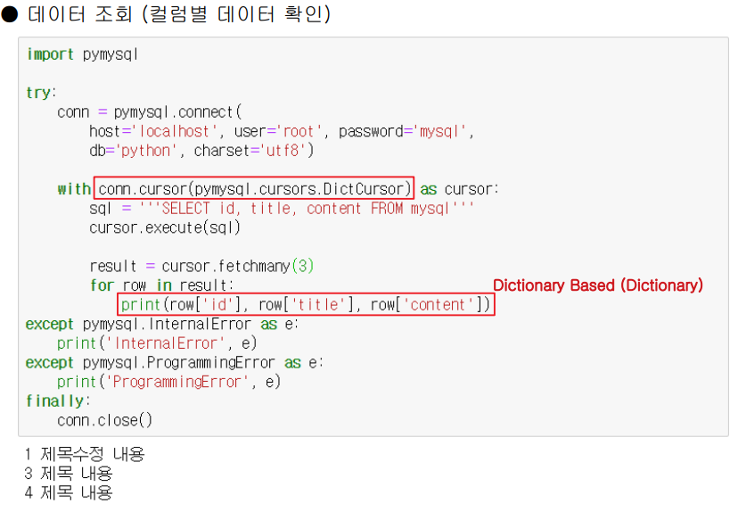

# database

일반적인 사용 절차 = >접속 후 Cursor 생성

1) 데이터베이스에 맞는 모듈 import

 2) 데이터베이스 접속 

3) Cursor 객체 생성 

4) Cursor 객체의 SQL 실행 메소드를 사용하여 CRUD 실행 - 조회의 경우 실행 결과를 추출

5) 데이터베이스 작업 완료 후 commit (저장) 

6) Cursor 객체 close 7) 접속 객체 close


```python
import pymysql

conn = None

try: 
    conn = pymysql.connect(
        host = 'localhost', user = 'root', password = '1234',
        db = 'python', charset = 'utf8') #데이터베이스 접속

    with conn.cursor() as cursor: # Cursor 객체 생성
        sql = '''CREATE TABLE mysql (
                    id INTEGER PRIMARY KEY AUTO_INCREMENT
                    , title VARCHAR(100), content VARCHAR(100))'''
        cursor.execute(sql) #sql실행
        conn.commit() #저장
    
except pymysql.InternalError as e:
    print(e)
    
finally: 
    
    conn.close() # Try 내의 지역변수
```

mysql  예외처리까지


place holder 방식...

%s%s

### 실행된 결과를 조회

#### fetchall()

이걸로 받은 것은 list 형태가 된다. 모두조회

근데 하나하나가 튜플형태기 때문에 튜플을 리스트가 감싸고 있는 형태로 반환되는 것이다

#### fetchone() 

한개 데이터 조회 한 건을 주욱나열(튜플 형태로)

#### fetchmany()

여러개 데이터 조회




딕셔너리 형태로 담아서

뽑아낼때도 딕셔너리 방식으로.!

요 방식이 많은 개발자들에게 선호된다


### sqlite

아주 간단하게 사용하는 데이터베이스로서 여러사람이 동시 접속하기엔 좋지 않다. 한 명이 쓰기엔 괜찮고 가벼움

