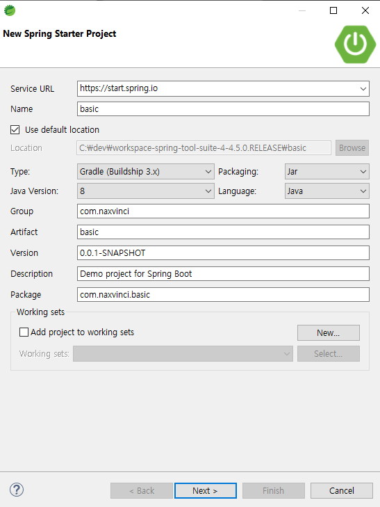
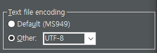
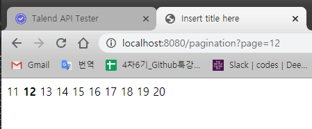

# Spring Boot

### 스프링부트 다운 받기

 https://spring.io/tools

spring.io/tools 에서 윈도우 이클립스용 스프링 부트를 설치

다운을 받았으면 상단에서 화살표 클릭, powershell을 실행 

powershell에서 java -jar spring까지 쓰고 tab키

--> 이게 안되면 java를 아무 곳에서 부를 수있게 환경변수 설정 or java 설치된 경로를 그 앞에 쓰고 java를 부르는 방법이 있다

압축 풀리면 sts-어쩌구 폴더가 생긴다

spring tool suite4

걍 이클립스 인터페이스넹

### lombok 라이브러리 

https://projectlombok.org/all-versions

power shell에서 java -jar lombok 하고 tab키

install 창이 나오면 경로를 설정

경로- sts폴더의 exe 파일로 설정


create new Spring Starter 클릭




쓸 기술들을 지정

- Lombok
- Spring Data JPA
- H2 Database
- Thymeleaf
- Spring Web

빌드 툴 양대산맥

- gradle 

- mayven 

Java IDE 양대산맥

- eclipse
- Intellij


### controller 만들기

com.naxvinci.basic 패키지 내에 controller 패키지 하나 만들어주기

```java
package com.naxvinci.basic.controller;

import org.springframework.web.bind.annotation.GetMapping;
import org.springframework.web.bind.annotation.RestController;

@RestController
public class TestController {
	@GetMapping("/test")
	public String test() {
		return "Hello~";
	}
}

```

- shft + ctrl + o : 한꺼번에 import 단축키
- @RestController 와 @GetMapping 은 필수
- 실행하자
- @GetMapping("/test")에 쓴대로 http://localhost:8080/test 로 실행 후 확인가능


ctrl + f11 하기 전 콘솔 창 실행을 먼저 정지시켜주어야 한다


주석

- comment (`//`) 사람이 보기 위한 주석

- annotation(`@`) : 컴퓨터가 보기 위한 주석


```
package com.naxvinci.basic.controller;

import org.springframework.stereotype.Controller;
import org.springframework.web.bind.annotation.GetMapping;

@Controller
public class Test2Controller {
	@GetMapping("/test2")
	public String test2() {
		return "hello";
	}
}
```

- 이 경우에는 hello라는 html 파일을 찾아가게됨


그냥 controller와 restcontroller의 차이

직접 찍을거냐

파일을 불러올거냐


### 이클립스 설정 변경하기

STS인코딩 설정 변경

- windows - preferences - encoding 검색 - workspace~ 
- 

- content types 를 제외한 모든 부분에서 utf-8로 설정


### Log 사용하기

로그를 찍는 두가지 방식

- 롬복을 사용할 것인지

- 로거로직접 명시 할 것인지


syso로 나올 것을 파일로 저장한다

로거 라이브러리를 쓰면 

- syso보다 출력속도가 훨씬 빠르다

- 파일 등을 이용하여 로그를 관리하기가 수월하다
- 성능 좋다능


롬복이랑 slf4j는 우왕굳 


로그가 그래서 뭘까...

- 실행 기록이라고 한다


#### 로거로 찍기

기존에는 info부터 보였는데 

```java
logger.trace("trace!");
logger.debug("debug!");  //여기까지는 개발단계에서 확인용
logger.info("info!");    // 운용 상 필요한 정보
logger.warn("warning!"); //메모리 문제 등 경고 -동작이 되긴 되는데 위태위태하다
logger.error("error!");  // 치명적 오류 - 동작이 안된다. 문제다 
```


application.properties 파일에 

```java
# log level
logging.level.com.ggoreb.basic=trace
```

이걸 찍으면 trace부터 다 보인다

#### 롬복으로 찍기

???


서버재가동 없이 어쩌구 하기

build.gradle 파일 내에 


우클릭 - gradle- refresh

반영해주어야함


### 응답처리

서버에서 주는 응답이 여러개다

클라이언트가 요청한 것에 대해 응답을 해주는 형태

@ResponseBody 또는 @RestController

- JSON
  - **map**, array, **list**, object 등
  - 이 때 `@ResponseBody`를 통해야 한다. 이걸 쓰지 않으면 html 파일을 찾아가려함
- HTML
  - string 형태


### restlet client

http method에는 post, get, put, delete가 있는데 post와 get 이외의 것을 test 해보기 위해서는 restlet client 플러그인이 필요하다.


|         결과          | 상태코드 |              설명               |
| :-------------------: | :------: | :-----------------------------: |
|        Success        |   200    |      요청에 대해 정상 응답      |
|      Bad request      |   400    |  파라미터 등 요구 조건 미충족   |
|       Forbidden       |   403    |            접근 거부            |
|       Not Found       |   404    | 잘못되었거나 존재하지 않는 주소 |
|  Method Not Allowed   |   405    |      사용 불가 메소드 사용      |
| Internal Server Error |   500    |    서버의 프로그램 오류 발생    |


요청처리의 여러 방식을 확인해보자

쥰나 뭐라는건지 모르겠어. 

http://ggoreb.com/http/method_form.jsp

get으로 호출 할 때는 잘 나오는데 post방식으로는 에러가 뜬다. 브라우저는 결국 100퍼센트 get방식만 사용된다는거임. post 등의 방식은 일반적인 방법으로는 보기어렵다. 이때 필요한게 restlet client다!!!!


주소 하나로 메소드를 바꾸면서 바꿔치기 로그인

get / board / 1

delete / board / 1

rest방식은 요즘 주소 하나에 메소드 분리를 통해 간결하게 사용

rest방식이 잘 되어있는 사이트

okky.kr

잘 안되어있는 사이트

tacademy.skplanet.com

### 요청처리

- RequestParam (편리함) : 혼자 혹은 친구들끼리 
- ModelAttribute (명확함) : 회사에서 선호하는 방식

클라이언트가 값을 주는데 어떤 방식으로 주느냐

받는 쪽에서의 이야기


java진영에서 쓰는 request의 정체 - HttpServletRequest

이걸 spring이 알아서 가공해줘서 사용하게 된다.request.getParameter("pageNum"); 이게 정석적인 방법. 전통적. 오래된 방식


@RequestParam("key1") String key1,

string에는 기본 리터럴 다 들어갈 수 있다.


```java
	@GetMapping("req/param1")
	public String param1(
	@RequestParam("key1") String key1,
	@RequestParam("key2") String key2) {
	return key1 + ", " + key2;
	}
```


http://localhost:8080/req/param1?key1=a&key2=1

이런 식으로 key를 넣어주면 출력이 된다. 추가적인 정보들


두번째 방식은 parameter 이름이 빠져있다. key를 지정하지 않고 map으로 받아준다. 이게 더 편해서 많이 쓴다.

```java
	@GetMapping("req/param2")
	public String param2(
	@RequestParam Map<String, Object> map) {
	return map.toString();
	}
```


http://localhost:8080/req/param2?a=123&b=456&key2=1

이렇게 키를 임의로 써 넣을 수 있다. 


### @RequestParam

```html
<form method='post' action="/login">
	ID : <input type= "text" name ="id"><br>
	PW : <input type= "text" name ="pw"><br>
		<input type = "submit">
	</form>
```


```
package com.naxvinci.basic.controller;

import org.springframework.stereotype.Controller;
import org.springframework.web.bind.annotation.GetMapping;
import org.springframework.web.bind.annotation.PostMapping;
import org.springframework.web.bind.annotation.RequestParam;

@Controller
public class LoginController {
	@GetMapping("/login")
	public String login() {
		return "login";
	}
	@PostMapping("/login")
	public String loginPost(
			@RequestParam("id") String id,
			@RequestParam("pw") String pw) {
		
		String dbId = "boot";
		String dbPw = "1234";
		
		if(dbId.equals(id) && dbPw.equals(pw)) {
			return "로그인 성공";
		}
		return "로그인 실패";
	}
}
```


@PathVariable -경로 자체를 변수로 쓰는 방식


### @ModelAttribute


```
	@GetMapping("req/model")
	public String model(
	@ModelAttribute Member member) {
	return member.toString();
	}
```


http://localhost:8080/req/model?name=11&userId=22&userPassword=33


### ThymeLeaf

신기술임. html template

```java
package com.naxvinci.basic.controller;

import java.util.ArrayList;
import java.util.HashMap;
import java.util.List;
import java.util.Map;

import org.springframework.stereotype.Controller;
import org.springframework.ui.Model;
import org.springframework.web.bind.annotation.GetMapping;

@Controller
public class Welcome {
	@GetMapping("/welcome")
	public String welcome(Model model) {
		List<String> list = new ArrayList<>();
		list.add("a");
		list.add("b");
		model.addAttribute("key1", list);
		
		Map<String, Object> map = new HashMap<>();
		map.put("a", "value a");
		map.put("b", "value b");
		model.addAttribute("key2", map);
		
		return "welcome";
	}

}
```

welcome.html

```html
[[${key1}]]
<br>
[[${key1[0]}]]
<br>
[[${key2}]]
<br>
[[${key2.a}]]
<br>
[[${key2['b']}]]
```

스프링부트에서는 타임리프를 쓴다. 

타임리프에서 권장하는 방식

```html
아이디:<span th:text="${user.userId}"></span><br>
이름:<span th:text="${user.userName}"></span><br>
나이:<span th:text="${user.userAge}"></span><br>
```


th:text에 생기는 노란 줄을 없애려면 아래 코드를 상단에

```html
<html xmlns:th="http://www.thymeleaf.org">
```


#### 페이지 만들기

계산하기

```
	 @GetMapping("pagination")
	 public String pagination(Model model, @RequestParam(defaultValue="1") int page) {
	 int startPage = (page - 1) / 10 * 10 + 1;
	 int endPage = startPage + 9;
	 model.addAttribute("startPage", startPage);
	 model.addAttribute("endPage", endPage);
	 model.addAttribute("page", page);
	 return "pagination";
	 }
```

model은 전달해주는 매개체 역할을 한다. 결국 클라이언트에게 작업 결과를 전달해주려면 html에게 전달해줘야 한다능


model을 쓰지않으면 파라미터에 뭘 넣든 변화가 생겨나지 않는다

```html
<!DOCTYPE html>
<html xmlns:th="http://www.thymeleaf.org">
<head>
<meta charset="UTF-8">
<title>Insert title here</title>
</head>
<body>
	<th:block
		th:each="pageNumber : ${#numbers.sequence(startPage, endPage)}">
		<span th:if="${page} == ${pageNumber}" th:text="${pageNumber}"
			style="font-weight: bold"></span>
		<span th:unless="${page} == ${pageNumber}" th:text="${pageNumber}"></span>
	</th:block>
</body>
</html>
```

