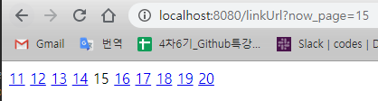

# spring boot2


### 페이지 넘버 동적으로 작동하기

```java
package com.naxvinci.basic.controller;

import java.util.ArrayList;
import java.util.HashMap;
import java.util.List;
import java.util.Map;

import org.springframework.stereotype.Controller;
import org.springframework.ui.Model;
import org.springframework.web.bind.annotation.GetMapping;
import org.springframework.web.bind.annotation.RequestParam;

@Controller
public class ThymeleafController {
	@GetMapping("/linkUrl")
	public String linkUrl(
//			@RequestParam int start,
//			@RequestParam int end,
			@RequestParam int now_page,
			Model model) {
		int start = (now_page - 1) / 10 * 10 + 1;
		int end = start + 9;
		model.addAttribute("start", start);
		model.addAttribute("end", end);
		return "linkUrl";
	}
```

html

```html
<th:block th:each="page : ${#numbers.sequence(start,end)}">
	<a href="#">[[${page}]]</a>
</th:block>
```


now_page를 추가하기

```java
@Controller
public class ThymeleafController {
	@GetMapping("/linkUrl")
	public String linkUrl(
//			@RequestParam int start,
//			@RequestParam int end,
			@RequestParam int now_page,
			Model model) {
		int start = (now_page - 1) / 10 * 10 + 1;
		int end = start + 9;
		model.addAttribute("start", start);
		model.addAttribute("end", end);
		model.addAttribute("now_page", now_page);
		return "linkUrl";
	}
```

- 이때 now_page는 필수값이다. 리퀘스트파람...
- 이걸 필수값으로 지정하고 싶지 않다면

```java
@RequestParam (defaultValue="1") int now_page
```

​		이런 식으로 `defaultValue`를 주면 된다. 


조건문 활용하기

```html
<th:block th:each="page : ${#numbers.sequence(start,end)}">
	<span th:if="${now_page == page}"
	th:text="${page}"></span>
	<a href="#" th:unless="${now_page == page}">[[${page}]]</a>
</th:block>
```


출력결과




### STS에서 Github에 업로드하기


업로드할 폴더 - team - share


## Session


HTTP : Hyper Text Transfer Protocol 

HTTPS : Hyper Text Transfer Protocol Secure

- stateless  :상태를 기억하지 않는다...내가 로그인읋 해도 새로고침하면 로그아웃 되어버리는. 

- 이런 문제를 해결하기 위해 나타난 것이 Session


사물함의 번호 같은 것.... 티켓 같은 것... 접속하자마자부터 그 티켓..번호가 할당되는 것임

접속 할 때 할당받는 티켓이 있다. 로그인할 때 이 티켓을 통해 새로고침을 하더라도 그래 너 1번! 서버에 할당된 공간 접근 오케이

이때 티켓을 잃어버린다면(=쿠키삭제) 로그인이 풀려버린다. 

세션만료 : 은행웹사이트에서 10분 정도 가만히 있으면 접속이 플려버림. 

클라이언트쪽에 저장되는 티켓- 쿠키

서버쪽에 저장되는 티켓 - 세션

서버를 껐다 키면 서버가 티켓을 잃어버리는 것. 로그인이 풀려버림

세션은 크기의 제한 없이 얼마든지 저장할 수 있는 편. 무제한은 아님 ㅜ 


### 로그인 화면 만들기

세션을 활용


```java
package com.naxvinci.basic.controller;

import javax.servlet.http.HttpSession;
import org.springframework.stereotype.Controller;
import org.springframework.web.bind.annotation.GetMapping;
import org.springframework.web.bind.annotation.PostMapping;
import com.naxvinci.basic.model.User;

@Controller
public class SessionController {
	@GetMapping("/login")
	public String login() {
		return "login";
	}

	@PostMapping("/login")
	public String loginPost(User user, HttpSession session) {
		session.setAttribute("user", user);
		return "redirect:/main";
	}

	@GetMapping("/main")
	public String main() {
		return "main";
	}
}
```

- `redirect:/main`   --> 이쪽 주소(/main)로 던져버리겠다는 의미
- `HttpSession session` --> 세션은 어디서든지(현재 스프링서버) 사용가능하다는 의미
- 

```
<!DOCTYPE html>
<html>
<head>
<meta charset="UTF-8">
<title>Insert title here</title>
</head>
<body>
 <form action="/login" method="post">
 ID : <input type="text" name="userId"><br>
 PW : <input type="password" name="userPw"><br>
 <input type="submit" value="로그인">
 </form>
</body>
</html>
```

- post방식

main.html

```html
<!DOCTYPE html>
<html>
<head>
<meta charset="UTF-8">
<title>Insert title here</title>
</head>
<body>
	<p th:if="${session.user} != null"
		th:text="${session.user.userId} + '님 반갑습니다.'"></p>
	<p th:unless="${session.user} != null">로그인되어 있지 않 습니다.</p>
</body>
</html>
```

- 세션에 유저아이디 값이 들어갔다면 ... 조건문


```java
package com.naxvinci.basic.model;

import lombok.Data;

@Data
public class User {
	private String userId;
	private String userPw;
}
```


크롬은 아무리 창을 많이 띄워도 세션을 모두 공유하는데 이를 분리하기 위해서는 시크릿모드를 사용하면 된다.

