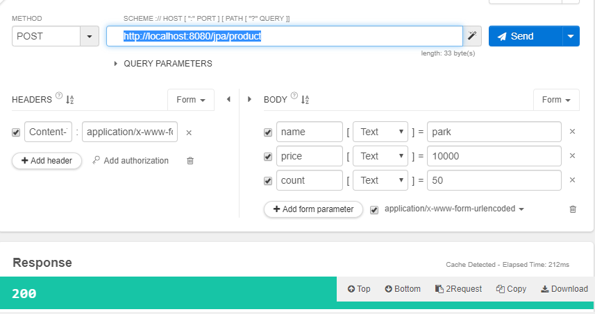
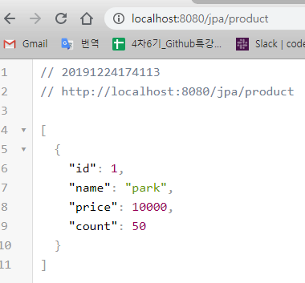
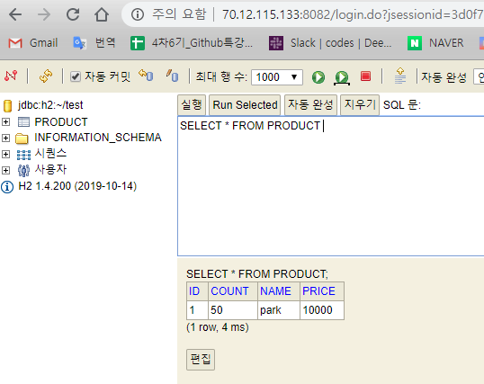

# spring boot

## AOP

> Aspect Oriented Programming 관점지향프로그래밍

공통적으로 적용되어야 할 기능을 하나 혹은 여러 클래스에 만들어 두고 이를 적용할 곳을 지정해두는 것.

가짜의 저장공간에 임시로 저장해두었다가 다 처리된 후 오리지널로 옮겨담는다. 이때 띠리한 상황이 생기면 전부 다 취소 해버린다. 이거 어마어마한거다. 스프링의 두가지 특징(IoC/DI와 AOP) 중 하나다.


- Inversion of Control/ Dependency Injection

리퀘스트파람, 리스폰스바디, 등등등 스프링이 만들어두었던 것들. 제어가 역전되었다. 프레임워크에게 제어권이 있다는 의미다. 변수만 선언해주면 그곳에 자동으로 의존성을 주입해준다.


- AOP

메소드의 성능 테스트, 트랜잭션 처리, 예외 반환, 로깅, 인증, 권한 처리 등에 사용한다. 이거 완전 엄청 중요기능임. 근데 현업에서 그다지 활용안함/ 너무 손쉽게 한줄로 구동가능해서...

굉장히 어렵고 고급기법이다. 


### AOP 종류

#### Pointcut 

Joinpoint 중 실제 Advice가 적용되는 지점

#### Advice

부가기능을 담은 모듈

#### Aspect 

Advisor의 집합 여러 객체에 공통으로 적용되는 공통 관심 사항 (포인트컷과 어드바이스를 합친것임)


언제+어디에+무엇을 이 합쳐져서 AOP가 실행된다.

메인 실행 전에 아이디가 로그인 되어있는지 여부를 체크하겠다. --> 이것을 하나의 클래스로 만들것이다. 이 클래스를 Aspect라고 부르는 것임


#### 4가지 시점

- @Before

- @After

- @AfterReturning

- @AfterThrowing


`*` - 별은 어떤 것이 와도 상관 없다는 의미. 전체. 

`*.*` - 별쩜별도 모오든 내용을 칭하는 것임

== 패키지 밑에 모든 클래스에 모든 메소드를 의미


```java
package com.naxvinci.basic.aspect;

import org.aspectj.lang.JoinPoint;
import org.aspectj.lang.annotation.After;
import org.aspectj.lang.annotation.AfterReturning;
import org.aspectj.lang.annotation.Aspect;
import org.aspectj.lang.annotation.Before;
import org.springframework.stereotype.Component;
import lombok.extern.slf4j.Slf4j;

@Slf4j
@Aspect
@Component
public class ControllerAspect {
	@Before(value = "execution (* com.naxvinci.basic.controller.*.*(..))")
	public void onBeforeHandler(JoinPoint joinPoint) {
		log.debug("@Before run");
	}

	@After(value = "execution (* com.naxvinxi.basic.controller.*.*(..))")
	public void onAfterHandler(JoinPoint joinPoint) {
		log.debug("@After run");
	}

	@AfterReturning(value = "execution (* com.naxvinci.basic.controller.*.*(..))", returning = "data")
	public void onAfterReturningHandler(JoinPoint joinPoint, Object data) {
		if (data != null) {
			log.debug(data.toString());
		}
		log.debug("@AfterReturning run");
	}
}
```

실행 전후 작동할 것을 지정하는 상황...


콘솔창에서는 이렇게 뜹디다. 

로그인 전후로 비포랑 애프터 찍혀나오는구만

```shell
2019-12-24 15:35:57.878 DEBUG 9152 --- [nio-8080-exec-3] c.n.basic.aspect.ControllerAspect        : @Before run
2019-12-24 15:35:57.884 DEBUG 9152 --- [nio-8080-exec-3] c.n.basic.aspect.ControllerAspect        : login
2019-12-24 15:35:57.884 DEBUG 9152 --- [nio-8080-exec-3] c.n.basic.aspect.ControllerAspect        : @AfterReturning run
```


#### ControllerAdvice


### Filter

1순위

3AOP : 어떠한 클래스든, 어떠한 메소드든 대상

- 서버환경이 아니더라도 실행이 된단

-> 스프링의 기능

1Filter : 접속하는 주소(url)를 대상

->자바의 고유 기능

2interceptor : 접속하는 주소(url)를 대상

->스프링의 기능


"/*" 주소에서도 *을 써주면 모든 주소를 말하게 된다


#### 로그인 안하면 메인으로 튕겨내기

인터셉터의 활용


```java
package com.naxvinci.basic.interceptor;

import javax.servlet.http.HttpServletRequest;
import javax.servlet.http.HttpServletResponse;
import javax.servlet.http.HttpSession;
import org.springframework.stereotype.Component;
import org.springframework.web.servlet.ModelAndView;
import org.springframework.web.servlet.handler.HandlerInterceptorAdapter;
import com.naxvinci.basic.model.User;
import lombok.extern.slf4j.Slf4j;

@Component
@Slf4j
public class SignInCheckInterceptor extends HandlerInterceptorAdapter {
	@Override
	public boolean preHandle(HttpServletRequest request, HttpServletResponse response, Object handler)
			throws Exception {
		log.debug("preHandle");
		HttpSession session = request.getSession();
		User user = (User) session.getAttribute("user");
		if (user == null) {
			response.sendRedirect("/login");
		}
		return super.preHandle(request, response, handler);
	}

	@Override
	public void postHandle(HttpServletRequest request, HttpServletResponse response, Object handler,
			ModelAndView modelAndView) throws Exception {
		log.debug("postHandle");
		super.postHandle(request, response, handler, modelAndView);
	}

	@Override
	public void afterCompletion(HttpServletRequest request, HttpServletResponse response, Object handler, Exception ex)
			throws Exception {
		log.debug("afterCompletion");
		super.afterCompletion(request, response, handler, ex);
	}
}
```

java


```java
package com.naxvinci.basic.config;

import org.springframework.beans.factory.annotation.Autowired;
import org.springframework.context.annotation.Configuration;
import org.springframework.web.servlet.config.annotation.InterceptorRegistry;
import org.springframework.web.servlet.config.annotation.WebMvcConfigurer;
import com.naxvinci.basic.interceptor.SignInCheckInterceptor;

@Configuration
public class InterceptorConfig implements WebMvcConfigurer {
	@Autowired
	private SignInCheckInterceptor signInCheckInterceptor;

	@Override
	public void addInterceptors(InterceptorRegistry registry) {
		registry.addInterceptor(
				signInCheckInterceptor)
		.addPathPatterns("/main");
		
		WebMvcConfigurer.super.addInterceptors(registry);
	}
}
```

- 인터셉터를 메인에 적용


### My Batis


### JPA


@Autowired - 변수는 만들어 쓰면 초기화나 어떤 값을 대입한 다음에 써야하는데 얘는 안불러냈다. 스프링의 특성임 (DI)


작업반장의 기능

```java
package com.ggoreb.basic.repository;
import org.springframework.data.jpa.repository.JpaRepository;
import org.springframework.stereotype.Repository;
import com.ggoreb.basic.model.Product;
@Repository
public interface ProductRepository extends JpaRepository<Product, Long>{
}
```


- 인터페이스는 상속을 받은 자식. 자식은 부모의 모든 것을 쓸 수 있다.


product라는 오브젝트에서 id는 어차피 자동으로 배정이 된다. 그러니 post 방식에서 따로 추가안해도..

post로 넣은 데이터는 get방식으로 확인도 가능





디비에 들어간걸 h2로 확인



