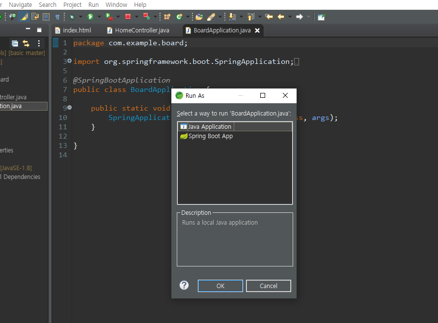

# springboot 게시판만들기

## 1)회원가입부터 로그인까지 페이지

흐름을 익히장

1. w3스쿨에서 템플릿 복사
2. 템플릿에 index.html 만들어서 넣기

3. com.example.board 패키지 내부에 controller패키지를 새로 만들고 HomeController를 만들어 넣는다

```java
package com.example.board;

import org.springframework.boot.SpringApplication;
import org.springframework.boot.autoconfigure.SpringBootApplication;

@SpringBootApplication
public class BoardApplication {

	public static void main(String[] args) {
		SpringApplication.run(BoardApplication.class, args);
	}

}
```

f11 실행시 BoardApplication에서 한다. 아래꺼 누르면 콘솔창이 컬러풀해진다 ㅎ




4. template을 분리한다

5. template 아래에 common이라는 패키지를 추가해서 head.html, nav.html, footer.html 을 추가

   ```java
   <head th:replace="common/head">
   </head>
   ```

   - 이런식으로 기존에 있던걸 뜯어내고 html파일들도 각각 옮긴 후 th:replace로 경로 설정

6. 로그인 페이지 만들기

   - signup.html 파일 만들어 BSform 넣기

   디자인 화면을 만든다

7. 컨트롤러를 통해 /signup 페이지와 html파일을 연결

   ```java
   	@GetMapping({ "/signup" })
   	public String signup() {
   		return "signup";
   	}
   ```

8. h2데이터베이스 실행하기

   - 스프링 다 끄고 embedded로 먼저 실행
   - 다시 나가서 server로 실행
   - 스프링 실행

9. 로그인페이지에서 회원가입(signup)

   - 데이터베이스에 데이터가 저장된다 - 사용자가 입력한 걸 디비에 저장한다.
   - 이때 post방식
   - 이때 model패키지 내의 User.java 파일 내의 변수들과 signup.html 내의 클래스 id들과 일치해야 한다
   - `@modelAttribute` - html에서 넘어오는 물음표랑 파라미터랑 modelAttribute의 변수랑 이름이 일치해야한다


10. 로그인 (signin)
    - 디비에 이메일과 비밀번호가 일치하는 것이 있는지 확인

```java
User dbUser = userRepository.findByEmailAndPwd(user.getEmail(), user.getPwd());
```

- 이메일을 통해 찾겠다. 여기에 And하고 계속 찾을 것을 덧붙여 생성해주어도 된다. 이때 이것들은 User 레파지토리 내에 변수로 생성되어 있어야한다. 

11. signout - 세션값을 모두 삭제
    - `session.invalidate();`


## 2) 게시판 만들기

CRUD : Create , Read(Retrieve), Update, Delete

1. 게시판 작성  페이지
   - 데이터베이스로 들어가야 하기 때문에 모델을 활용
   - 오토와이어드를 통해 httpsession을 쓰면 서버 어딘가 있는 session을 불러올 수 있다. 
   - `session.getAttribute("user_info");` : 로그인을 했는데 게시글을 쓰기 전 이름을 또 물어볼 수 없기 때문에 세션에서 사용자의 정보를 겟 

2. 로그인을 하지 않고 /board/write 페이지에 가는 경우 `String userId = user.getEmail();` 이 값이 null이 되기 때문에 오류가 나게 된다 

3. 게시판 조회(목록)만들기 -- 이게 제일 어려움원래
4. 역순으로 만들기


일반적으로 위치를 알아낼 때 ajax를 쓴다

자바스크립트를 이용해서 위도 경도를 알아낼 수 있는데 허가를 받아야 한다. 스크립트로 정보를 알아냄..?


겟포인트는 대괄호로 시작하는 데이터이기 때문에 반복문을 돌린다. 추출해야지...


위도경도 정보 념겨줄 때 나의 위도 경도도 함께 넘겨준다/ 그래서 거리계산 가능 

내 기준으로 10키로보다 초과되는 포인트는 삭제를 시켜버린다. distance 활용이지요

반복문을 역순으로 동작 시켰다. 왜? 

리스트의 특징 - 1,2,3,4가 있으면 3이 지워졌을때 자동으로 정렬해버린다. 그래서 역순으로 지워줘야 안밀리기 때문에

위도경도를 알아내는 코드는 비동기다 = 순서대로 실행이 되지 않는다. 지도도 그렇다. 그럼 지도가 먼저 떠버릴 수 있음. 이걸 막기 위해 하나의 종괄호로 감싸서 한 함수로 만들어 버리면 순서를 지킬 수 있음


이메일 - 구글에서 발급하는 메일앱 비밀번호를 발급받아야한다


심플 메일  트랜스퍼? 프로토콜